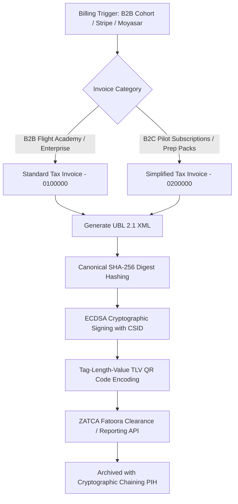

# ZATCA Fatoora Phase 2 E-Invoicing Compliance Architecture

This document establishes the technical, operational, and regulatory architecture for **ZATCA (Zakat, Tax and Customs Authority) Fatoora Phase 2 Integration** across BDA Company International's platforms (**Fly GACA** and **Captain Adel**).

---

## 1. Corporate & Tax Entity Identity

All invoices generated by Fly GACA B2B billing and consumer subscriptions strictly inherit from corporate facts in `01-governance/company-facts.md`:

| Parameter | Certified Value |
|---|---|
| Legal Name (Arabic) | **شركة بدع الدولية** |
| Legal Name (English) | **BDA Company International** |
| Commercial Registration (CR) | **7030976893** |
| VAT Registration Number | **311415259500003** |
| Taxpayer Identification (TIN) | **3114152595** |
| Registered National Address | 2816 King Fahd Rd, Al Sahafah Dist., Riyadh 13321-6548, Saudi Arabia |
| Standard Tax Rate | 15% Standard VAT |

---

## 2. Invoicing Classification & Flows

### 2.1 Standard Tax Invoices (B2B - Code `388 / 0100000`)
- **Use Case**: Flight Academy bulk seat licenses (e.g., OxfordSaudia, SNAA, Saudi Aramco Aviation).
- **Clearance Workflow**: XML is transmitted to ZATCA Fatoora Clearance API before delivery to the customer. Once approved, the signed XML with clearance status is delivered.
- **Buyer Identifiers**: Mandatory Buyer Name, Buyer National Address, and Buyer VAT Number (where registered).

### 2.2 Simplified Tax Invoices (B2C - Code `388 / 0200000`)
- **Use Case**: Individual student pilots purchasing Pro annual passes or AIP Exam Prep bundles.
- **Reporting Workflow**: Generated immediately with Phase 2 TLV QR code and reported asynchronously to ZATCA within 24 hours.

---

## 3. Cryptographic & Data Structures

### 3.1 Tag-Length-Value (TLV) QR Code (Phase 2 Specification)
The QR code embedded on all generated PDF and HTML invoices encodes a 9-tag Base64 binary payload:

1. **Tag 1**: Seller Name (`BDA Company International`)
2. **Tag 2**: Seller VAT Number (`311415259500003`)
3. **Tag 3**: Invoice Timestamp (`YYYY-MM-DDTHH:MM:SSZ`)
4. **Tag 4**: Invoice Total with VAT (`SAR X.XX`)
5. **Tag 5**: Total VAT Amount (`SAR X.XX`)
6. **Tag 6**: SHA-256 Invoice XML Digest
7. **Tag 7**: ECDSA Digital Signature (using secp256k1 / NIST P-256)
8. **Tag 8**: Seller Public Key (from CSID)
9. **Tag 9**: ZATCA Certificate Authority Signature

### 3.2 Cryptographic Chaining (Previous Invoice Hash - PIH)
Every invoice header includes a `<cac:AdditionalDocumentReference>` element containing the SHA-256 hash of the immediate preceding invoice (`PIH`). The genesis invoice uses a certified fixed seed hash (`NWZlY2ViNjZmZmM4NmYzOGQ5NTI3ODZjNmQ2OTZjNzljMmRiYzIzOWRkNGU5MWI0NjAzZTQ4MmUwNzMzNGZhNw==`), establishing an immutable audit ledger compliant with anti-tampering mandates.

---

## 4. Implementation Reference

The production implementation resides in:
- Engine: `FlyGACA/server/src/zatca-core.ts`
- Automated Verification: `FlyGACA/server/tests/zatca-core.test.ts` (4 unit tests verifying TLV encoding, SHA-256 digest, UBL 2.1 generation, and Academy B2B billing).
- Tax Invoice Template: `Office/03-finance/tax-invoice-template.html`

---

## 5. Record Retention & Archival

Per ZATCA Article 66, all XML invoices, cryptographic logs, and verification responses must be archived in encrypted, in-Kingdom storage (Google Cloud Platform `me-central2` Dammam region) for a statutory period of **not less than 6 years (72 months)**.
