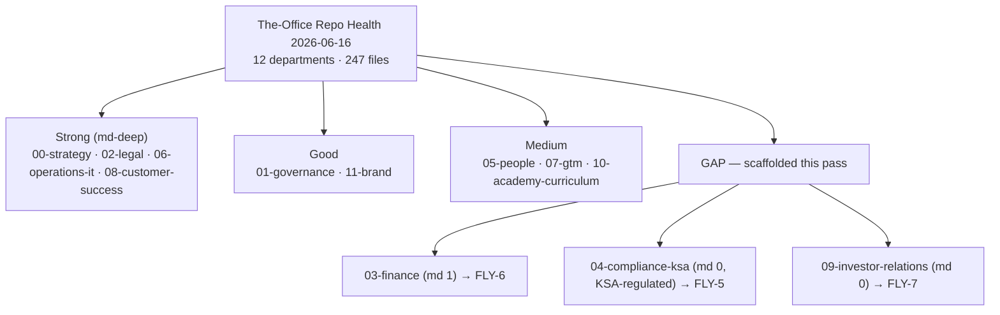

# The-Office — Repository Health Report

_Status: current · Last updated: 2026-06-16 · Owner: ops_

This is the single front door for the health of **The-Office** documentation repository.
It synthesizes the standing audits (linked below), records the canonical resolutions to
facts that kept getting re-litigated, scores each department by documentation depth, and
tracks the open hygiene/structure actions. It is **about this repo** (the operating
documents); the application code lives in separate repositories and is covered only where
a doc audit points at it.

> **Repo at a glance (2026-06-16):** 12 numbered departments · 247 tracked files ·
> documentation/spec repo (no application source). Reorganized and hygiene-swept this date.

---

## 1. Standing audits (don't duplicate — link)

These reports remain authoritative for their domains. Read them at source; this report
only summarizes status and removes the need to hunt for them.

| Audit | Scope | Where |
|---|---|---|
| Improvement Audit | 5-pillar review of app code/UX/content/strategy | `improvement-audit.md` |
| QA Consistency Sweep | Cross-doc fact consistency (region, corpus counts) | `qa-consistency-sweep-2026-06-14.md` |
| Content QA | GACAR corpus extraction quality (OCR, anchors) | `content-qa.md` |
| Consolidation Manifest | What was merged/superseded during consolidation | `consolidation-manifest-2026-06-16.md` |
| Content Integration Plan | How external content folds into the library | `content-integration-plan.md` |
| Test Coverage Analysis | Spec-vs-test gap audit across `SPEC-*` | `test-coverage-analysis-2026-06-16.md` |
| Legal Gap Audit | Legal-pack completeness | `../02-legal/legal-gap-audit-2026-06-14.md` |
| HR Pack Gap Audit | People-pack completeness | `../05-people/hr-pack-gap-audit-2026-06-14.md` |
| Ground-School Gap Audit | Curriculum coverage | `../10-academy-curriculum/ground-school-curriculum-gap-audit-2026-06-14.md` |

## 2. Canonical resolved facts (stop re-litigating these)

The consistency sweep settled two facts that recur across documents. **These values are
authoritative**; if a document disagrees, the document is stale, not this table.

### 2.1 GCP region mapping
| Region | Location | Role |
|---|---|---|
| `me-central1` | **Doha, Qatar** | Interim compute (Cloud Run); **not** in-Kingdom |
| `me-central2` | **Dammam, Saudi Arabia** | PDPL target; Firestore already live here; compute pending |

The ~170 occurrences across the repo use this mapping correctly. Two files had it
**reversed** (flagged for human edit in the sweep): `00-strategy/book-of-fly-gaca-review-2026-06-14.md`
line 60 and `.claude/agents/flygaca-qa-reviewer.md` line 15.

### 2.2 Corpus counts
Canonical: **74 GACAR Parts · 21 topical handbooks · 190 reference documents · 61 aerodromes ·
13 charts**, indexed by BM25 across **47,361 chunks**.

Stale figures to ignore (predate handbook integration): "96 documents / 75 Parts / 17 admin
eBooks / 29,749 chunks" in `the-book-of-fly-gaca.html` line 771. Note the "17 administration
eBooks" (GACA Guidance-Manual PDFs) are a *different set* from the app's "21 handbooks"
(topical HTML ebooks).

## 3. Documentation-depth scorecard

Markdown depth is a proxy for "is this department's thinking written down and diffable,"
not for the quality of the polished `.docx`/`.xlsx` deliverables (which can be excellent
while `md=0`).

| Dept | Files | `.md` | Depth | Note |
|---|---:|---:|---|---|
| 00-strategy | 25 | 7 | ●●●● | Strong narrative + brainstorms |
| 01-governance | 12 | 4 | ●●● | Repo-meta + core agreements |
| 02-legal | 26 | 17 | ●●●● | Deepest md coverage; briefs + audits |
| 03-finance | 10 | 1 | ●○○○ | **Gap** — only monetization.md in md |
| 04-compliance-ksa | 13 | 0 | ○○○○ | **Gap (highest value)** — KSA-regulated, no md |
| 05-people | 14 | 3 | ●●○ | Audit + a few notes |
| 06-operations-it | 48 | 36 | ●●●● | Specs/runbooks hub |
| 07-gtm | 14 | 4 | ●●○ | Playbooks mostly in docx |
| 08-customer-success | 17 | 9 | ●●●● | Well-documented in md |
| 09-investor-relations | 21 | 0 | ○○○○ | **Gap** — deck/xlsx only, no md thesis |
| 10-academy-curriculum | 11 | 3 | ●●○ | Curriculum + audit |
| 11-brand | 29 | 5 | ●●● | Design system + assets |

Three departments scaffolded this pass to close the worst md gaps (see §4): `03-finance`,
`04-compliance-ksa`, `09-investor-relations`.

## 4. Action tracker

| # | Area | Action | Status |
|---|---|---|---|
| H1 | Hygiene | Add `.gitignore` (DS_Store/bak/editor cruft) | ✅ Done |
| H2 | Hygiene | Untrack 4 `.DS_Store` + 1 `.bak` | ✅ Done |
| H3 | Hygiene | Declare binaries in `.gitattributes` | ✅ Done |
| H4 | Hygiene | Delete abandoned `FLYGACA_DOCUMENTATION_COMPILATION.md` stub | ✅ Done |
| N1 | Naming | Normalize filenames to ASCII kebab-case; fix links + `_INDEX.md` | ✅ Done |
| N2 | Naming | Document the convention (§6 below) | ✅ Done |
| C1 | Content | Scaffold finance / compliance / investor md docs | ✅ Done (templates) |
| C2 | Content | Refresh stale status docs (PHASE0, ROADMAP, briefings) | ✅ Done (flagged) |
| X1 | External | Update the Google-Sheet master index + any Drive deep-links to renamed files | ⛔ Owner action |
| X2 | Content | Fix the 2 reversed region refs (§2.1) | ⛔ Owner action |
| X3 | Content | Update `the-book-of-fly-gaca.html` line 771 to canonical counts (§2.2) | ⛔ Owner action |
| X4 | Content | 41 pre-existing broken cross-refs in vendored docs point at the app-repo layout (`../functions/`, `../scripts/`, flat `office/`/`docs/`); predate this work, not caused by the rename | ⛔ Owner action |

## 5. Notes & caveats

- **Filenames are now lowercase kebab-case**, which is less Drive-friendly than the prior
  Title Case but consistent and link-safe. New files should follow §6.
- **App-code findings** (improvement-audit, test-coverage-analysis) are tracked here for
  visibility but are actioned in the application repos (`functions/`, `assets/`, `captadel/`),
  not in The-Office.
- **Vendored guidance files were left untouched.** `01-governance/CLAUDE.md` (and
  `CONTRIBUTING.md`) describe the *application* repo's layout (`office/`, `functions/`), so their
  internal file references were deliberately **not** rewritten during the rename — they point at
  the app repo, not at The-Office.
- This report is the place to record future repo-health resolutions so they live in one
  durable spot instead of scattered briefings.

## 6. File-naming convention

All files in The-Office use **lowercase kebab-case, ASCII only**:

- lowercase; words separated by single hyphens (`-`).
- spaces → `-`; `&` → `and`; parentheses dropped; underscores → `-`; em/en-dashes → `-`.
- no spaces, no Unicode, no `&()` — keeps names link-safe and shell-safe.
- keep date suffixes as `-YYYY-MM-DD` (e.g. `legal-gap-audit-2026-06-14.md`).
- **Exceptions (kept as-is):** GitHub/repo-standard files — `README*`, `LICENSE`, `SECURITY.md`,
  `CONTRIBUTING.md`, `CODE_OF_CONDUCT.md`, `CLAUDE.md` — the top-level `_INDEX.md`, and the
  `.claude/` tooling directory.

Examples: `Annual Strategic Plan & OKRs (FY2026-2027).docx` → `annual-strategic-plan-and-okrs-fy2026-2027.docx`;
`SPEC-crm.md` → `spec-crm.md`; `00 Brainstorms — Index.docx` → `00-brainstorms-index.docx`.

## 7. External mirrors & tracking

This report is canonical in git. For visibility it is mirrored to connected apps, and the
owner follow-ups (§4, X-rows) are tracked as Linear issues:

| Where | What | Link |
|---|---|---|
| Notion | Readable mirror of this report | `app.notion.com/p/38228777bb7b81a89604f12382d15abd` |
| Google Drive | Filename reconciliation CSV (204 old→new pairs) | `drive.google.com/file/d/1VLQd71DoZ5SdvJjEdHJba5DBycyF0hTo` |
| Repo | Same CSV, committed | `../drive-index-updates.csv` |
| Linear (Flygaca) | FLY-5 compliance · FLY-6 finance · FLY-7 investor · FLY-8 stale-status · FLY-9 reconciliation | `linear.app/flygaca` |
| Airtable | Base "The-Office Repo Health" — **Actions** (12 rows, this §4 tracker) + **Renames** (204 old→new pairs) | `airtable.com/appuQmMO0TK5o4RAZ` |
| Lucid | Department-health scorecard diagram (doc-depth + FLY-5/6/7 gap callouts) | `lucid.app/lucidchart/696634c6-1850-4a11-a5dd-03a4f34c474e/view` |
| Google Calendar | 5 reminders (Asia/Riyadh) for FLY-5…FLY-9, staggered by priority | `calendar.google.com` (flygaca@gmail.com) |
| Jira (flygaca) | FLY-5…FLY-9 mirrored as tasks KAN-4…KAN-8 in the KAN project | `flygaca.atlassian.net/browse/KAN-4` |
| Canva | One-page branded "Repository Health" report summary (4 pages, editable) | `canva.com/d/Hu3E3N-TmO1VSuT` |

**Apps evaluated for wiring but intentionally not connected** (honest record):
- **Cloudflare / Vercel / Netlify** — publishing this repo (which holds legal, finance, compliance
  and investor documents) to a hosting provider would expose internal material; **not** auto-deployed.
- **Semrush** — the connected plan does not include MCP/API access (`semrush.com/mcp-access`).
- **HubSpot** — connected, but it models customers/deals, not repo artifacts; no clean fit.
- **Zoom / Amplitude** — connected but empty (no recordings / no product events) — nothing to mirror.
- **Confluence / Slack** — not available on the connected accounts (Jira-only Atlassian; no Slack link).

The master paperwork-index Google Sheet is locked from AI access ("ineligible for generative
AI contexts"), so it could not be auto-reconciled; FLY-9 carries the CSV for a manual paste.
A Confluence mirror was requested but **skipped**: the connected Atlassian site
(`flygaca.atlassian.net`) exposes Jira only — no Confluence product/scope — so the Notion page
above remains the canonical non-git mirror.

### Department-health diagram (Mermaid)

A copy of the Lucid scorecard, embedded here so the visual lives in git:

