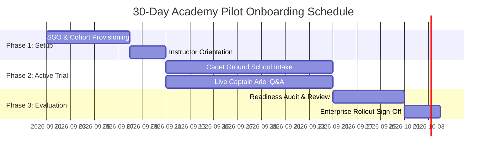

<div align="center">

# 🦅 Fly GACA for Flight Academies (Part 141 ATOs)
### Modern Ground School Enablement, AI Flight Instruction & Regulatory Mastery
#### العرض التقديمي لأكاديميات ومعاهد الطيران المرخصة · منصة التدريب الأرضي الرقمية والتحليلات

<p align="center">
  
  
  
  
</p>

</div>

---

## 📑 Slide 1: The Executive Vision

```
┌──────────────────────────────────────────────────────────────────────────────┐
│                    SAUDI NATIONAL AVIATION STRATEGY 2030                     │
│               Training 20,000+ Pilots & Aviation Professionals               │
└──────────────────────────────────────────────────────────────────────────────┘
```

- **Mission:** Empower Saudi Approved Training Organizations (ATOs) with the world's most advanced regulatory ground school, AI flight instruction, and cohort readiness analytics.
- **Operator:** **BDA Company International** (شركة بدع الدولية) — Riyadh, Kingdom of Saudi Arabia (CR: 7030976893 · VAT: 311415259500003).

---

## 📑 Slide 2: The Modern ATO Ground School Challenge

| Traditional Pain Point | Operational Impact on Academy | Cadet Friction |
|:---|:---|:---|
| **Complex GACAR Air Law** | Static PDFs, difficult cross-referencing between Part 61, 91, and AIP. | Cadets memorize without understanding; high exam retake rate. |
| **Ground School Bottlenecks** | Instructors spend 40%+ of ground school answering repetitive basic rules. | Ground training delays delay expensive flight line scheduling. |
| **Manual Readiness Audits** | Paper sign-offs and fragmented mock tests before official GACA exam endorsement. | Chief Flight Instructors (CFIs) lack real-time visibility on cohort weak spots. |

---

## 📑 Slide 3: The Fly GACA Integrated Solution

```
                            ┌─────────────────────────────────────────┐
                            │    🦅 FLY GACA ENTERPRISE ECOSYSTEM     │
                            └────────────────────┬────────────────────┘
                                                 │
         ┌───────────────────────────────┬───────┴───────────────────────┬───────────────────────────────┐
         ▼                               ▼                               ▼                               ▼
┌───────────────────┐           ┌───────────────────┐           ┌───────────────────┐           ┌───────────────────┐
│ 📖 Regulatory RAG │           │ 🧮 55+ Calculators│           │ 🤖 Captain Adel AI│           │ 📊 CFI Dashboard  │
│ 74 GACAR Parts &  │           │ Crosswind, W&B CG,│           │ 24/7 Ground Tutor │           │ Live Cohort Radar │
│ Saudi AIP Charts  │           │ Density Altitude  │           │ 'Cite-or-Refuse'  │           │ & GACA Endorsement│
└───────────────────┘           └───────────────────┘           └───────────────────┘           └───────────────────┘
```

1. **Digital Regulatory Library:** 74 GACAR Parts indexed down to every paragraph (§61.105, §91.155, §141.67).
2. **55+ Flight Deck Calculators:** Exact mathematical models for crosswind, fuel endurance, and density altitude.
3. **Captain Adel AI:** Grounded flight instructor available 24/7 in English and Arabic.
4. **Academy Admin Portal:** Real-time cadet progress tracking, weak subject analytics, and automated readiness gates.

---

## 📑 Slide 4: GACAR Part 141 Curriculum Mapping

```
├── 🎓 PPL Syllabus (Part 141 App B)
│   ├── Air Law (§61.105, Part 91 Operating Limits)
│   ├── Flight Planning & VFR Weather Minima (§91.155)
│   └── Aircraft Performance (W&B Envelope, Density Alt)
│
├── ✈️ CPL Syllabus (Part 141 App D)
│   ├── Commercial Privileges (§61.129, Part 119/135 Scope)
│   ├── Complex Aircraft Systems & High-Altitude Operations
│   └── Night VFR & Cross-Country Nav Logs
│
└── 🧭 Instrument Rating (IR) (Part 141 App C)
    ├── IFR Enroute & Terminal Procedures (§61.65, §91.167)
    ├── Holding Pattern Entry Resolvers & Wind Triangles
    └── Saudi AIP Approach Plate & Aerodrome Directory
```

---

## 📑 Slide 5: Chief Flight Instructor (CFI) Analytics Dashboard

- **Cohort Readiness Radar:** Automatic progress scoring determining when a student exceeds the 80% readiness benchmark.
- **Subpart Weakness Heatmap:** Pinpoint exact GACAR subparts where cadets struggle (e.g. Altimeter Setting Procedures vs Wake Turbulence).
- **Stage Check Digital Endorsements:** One-click audit trails verifying Ground School completion before booking practical checkrides.
- **Exportable Compliance Logs:** Instant CSV/PDF reports formatted for GACA safety audit inspections.

---

## 📑 Slide 6: Proven ROI & Performance Metrics

```
  ┌─────────────────────────┐     ┌─────────────────────────┐     ┌─────────────────────────┐
  │         -28%            │     │          +94%           │     │          100%           │
  │   Ground School Hours   │     │    First-Time Pass      │     │    ZATCA & PDPL KSA     │
  │   Saved Per Cadet Intake│     │    On Official GACA Exam│     │    Regulatory Compliance│
  └─────────────────────────┘     └─────────────────────────┘     └─────────────────────────┘
```

---

## 📑 Slide 7: Enterprise Pricing & Commercial Tiers

| Tier | Capacity | Key Features Included | Annual Investment |
|:---|:---:|:---|:---:|
| **Cohort Pack** | Up to 25 Cadets | 90-day intake access, Admin Dashboard, CSV readiness exports, Email support | **SAR 12,500** / cohort |
| **Academy Pro** | Up to 100 Cadets | Rolling 12-month access, Co-branded academy portal, Custom pass marks, Priority support | **SAR 39,000** / year |
| **Institutional Campus** | 100+ Cadets | Multi-campus SSO (Google Workspace / Microsoft Entra ID), Custom syllabus mapping, Dedicated Account Executive | **Custom Quote** |

*All plans include ZATCA Phase 2 compliant e-invoices with QR verification.*

---

## 📑 Slide 8: 30-Day Pilot Program Implementation Roadmap



---

## 📑 Slide 9: Contact & Next Steps

- **Official Web Portal:** [flygaca.com/schools](https://flygaca.com/schools)
- **Captain Adel AI Demo:** [captadel.com](https://captadel.com)
- **Commercial Inquiries:** `schools@flygaca.com`
- **Headquarters:** BDA Company International, Riyadh, Kingdom of Saudi Arabia

---

<div align="center">

<sub>🇸🇦 صنع في السعودية · Made in Saudi Arabia</sub>

</div>
