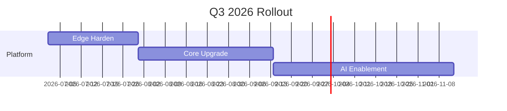

# Flygaca Document Style and Design Guideline
**Version 1.0** – *Last Updated: 2026-06-16*  
*Maintainer: Flygaca Design Systems Team*  
*Classification: Internal Use Only*

---

## Table of Contents
1. [Overview](#overview)
2. [Principles](#principles)
3. [Visual Foundations](#visual-foundations)
   - [Color Palette](#color-palette)
   - [Typography](#typography)
   - [Spacing & Layout](#spacing--layout)
   - [Iconography & Imagery](#iconography--imagery)
4. [Component Library (Document Elements)](#component-library-document-elements)
   - [Typography Styles](#typography-styles)
   - [Color Usage](#color-usage)
   - [Layout Structures](#layout-structures)
   - [Lists & Lists Styles](#lists--lists-styles)
   - [Tables](#tables)
   - [Code Blocks & Technical Content](#code-blocks--technical-content)
   - [Callouts & Alerts](#callouts--alerts)
   - [Images, Icons & Media](#images-icons--media)
   - [Hyperlinks & Cross-references](#hyperlinks--cross-references)
   - [Headers, Footers & Page Numbers](#headers-footers--page-numbers)
   - [Accessibility Considerations](#accessibility-considerations)
5. [Usage Guidelines](#usage-guidelines)
   - [Dos and Don'ts](#dos-and-donts)
   - [Document-Specific Guidance](#document-specific-guidance)
     - [Markdown](#markdown)
     - [Word (.docx)](#word-docx)
     - [PDF](#pdf)
     - [Excel (.xlsx)](#excel-xlsx)
     - [PowerPoint (.pptx)](#powerpoint-pptx)
6. [Implementation Notes](#implementation-notes)
   - [Design Tokens](#design-tokens)
   - [Word Template Styles](#word-template-styles)
   - [Excel Cell Styles & Themes](#excel-cell-styles--themes)
   - [PowerPoint Slide Master](#powerpoint-slide-master)
   - [PDF Export Settings](#pdf-export-settings)
   - [Automation & Validation](#automation--validation)
7. [Examples](#examples)
   - [Markdown Snippet](#markdown-snippet)
   - [Word Document Sample](#word-document-sample)
   - [Financial Report (Excel)](#financial-report-excel)
   - [Presentation Slide (PowerPoint)](#presentation-slide-powerpoint)
   - [PDF Export Example](#pdf-export-example)
8. [Changelog](#changelog)
9. [Appendix: Reference Files](#appendixreference-files)

---

## Overview
This guideline captures the Flygaca visual and experiential feel for all office documents produced within `/Users/flygaca/Documents/Fly GACA /The Office/`. It unifies the existing Markdown Document Style Guide with brand‑level specifications for Word, PDF, Excel, and PowerPoint, ensuring that every artifact—whether a strategy memo, legal contract, financial model, or deck—embodies Flygaca’s core values: **modern, clean, vibrant, and user‑centric**.

The guideline is built upon the *Flygaca Design System* (see `Design System.html` and `Design System.pdf`) and the *Fly GACA Brand Identity Sheet*. It translates UI‑focused tokens (color, typography, spacing) into practical document‑level styles while preserving the underlying design language.

---

## Principles
| Principle | Description | Application |
|-----------|-------------|-------------|
| **Modern** | Clean lines, contemporary typography, purposeful use of vibrant accent colors. | Use Inter/Cairo/JetBrains Mono; avoid ornamental fonts; keep layouts uncluttered. |
| **Clear** | Information hierarchy that guides the eye naturally; consistent visual weight. | Apply clear heading hierarchy; ample whitespace; consistent alignment. |
| **Vibrant** | Strategic use of the Falcon theme to highlight key information without overwhelming. | Accent colors (Falcon Blue, Orange, Green, Red, Purple) used sparingly for calls‑to‑action, alerts, metrics. |
| **User‑Centred** | Prioritizing readability, scannability, and accessibility for internal and external audiences. | Minimum 14pt body text; WCAG AA contrast; alternative text for images; logical reading order. |

---

## Visual Foundations
### Color Palette
Flygaca’s **Falcon Theme** provides a restrained yet vivid palette optimized for both screen and print.

| Color | Hex | Usage Guidelines | Accessibility (WCAG AA on White) |
|-------|-----|------------------|-----------------------------------|
| Falcon Blue | `#0066FF` | Primary accents, hyperlinks, key highlights | ✔️ 4.5:1 |
| Falcon Orange | `#FF6B35` | Callouts, warnings, important notes | ✔️ 4.5:1 |
| Falcon Green | `#00C853` | Success indicators, positive metrics | ✔️ 4.5:1 |
| Falcon Red | `#FF3D00` | Errors, critical alerts, financial negatives | ✔️ 4.5:1 |
| Falcon Purple | `#9D4EDD` | Strategic insights, innovation markers | ✔️ 4.5:1 |
| Dark Charcoal (Body) | `#2D3748` | Primary body text | ✔️ 7.2:1 |
| Medium Gray | `#4A5568` | Secondary text, subtitles | ✔️ 4.6:1 |
| Light Gray | `#718096` | Tertiary text, footnotes (≤20% volume) | ✔️ 3.2:1 (use only for low‑emphasis) |
| Border Gray | `#E2E8F0` | Tables, dividers, code block backgrounds | N/A |
| White | `#FFFFFF` | Document background | N/A |

**Rules**
1. **Text Color** – Primary text must be Dark Charcoal on White; never pure black (`#000000`). Light Gray may be used for footnotes or helper text but must not exceed 20% of total text volume.
2. **Accent Limits** – Maximum **2 accent colors** per document section. Falcon Blue reserved for primary actions/links. Falcon Orange limited to **3 instances per page** for high‑priority alerts. Falcon Green/Red used **only** to convey clear positive/negative status (never decorative).
3. **Backgrounds** – Main document background White. Code blocks: Border Gray background with 1 px padding. Callout boxes: 10 % tint of the accent color (e.g., Falcon Blue → `#E6F0FF`).
4. **Accessibility** – All text must meet WCAG AA contrast ratios. Never rely solely on color to convey information; pair with icons or text labels. Verify grayscale rendering for printed documents.

### Typography
Flygaca employs a three‑font system tuned for legibility on both digital and printed media.

| Purpose | Font | Weight Variants | Typical Uses |
|---------|------|-----------------|--------------|
| **Primary Body** | Inter | 400 (Regular), 500 (Medium), 600 (SemiBold) | Paragraph text, table contents, list items |
| **Headings & Accents** | Cairo | 600 (SemiBold), 700 (Bold), 800 (ExtraBold) | Document titles, section headers, callouts |
| **Code & Technical** | JetBrains Mono | 400 (Regular), 500 (Medium) | Inline code, code blocks, file paths, command output |

#### Hierarchy & Sizing (Point values → approximate pixel values at 96 dpi)
| Context | Font | Size (pt) | Size (px) | Weight |
|---------|------|-----------|-----------|--------|
| Document Title | Cairo | 32 pt | 43 px | 800 ExtraBold |
| Section Header | Cairo | 24 pt | 32 px | 700 Bold |
| Subsection Header | Cairo | 20 pt | 27 px | 600 SemiBold |
| Sub‑Subsection Header | Cairo | 18 pt | 24 px | 600 SemiBold |
| Body Text | Inter | 14 pt | 19 px | 400 Regular |
| Bold Emphasis | Inter | 14 pt | 19 px | 600 SemiBold |
| Italic Emphasis | Inter | 14 pt | 19 px | 400 Regular *italic* |
| Inline Code | JetBrains Mono | 13 pt | 17 px | 400 Regular |
| Code Block Body | JetBrains Mono | 13 pt | 17 px | 400 Regular |

**Special Cases**
- **Legal Documents** – Use Cairo 700 for clause numbers (e.g., “3.2.”).
- **Financial Reports** – JetBrains Mono for all monetary figures, account codes, and IDs.
- **Strategy Docs** – Cairo 800 for vision statements and strategic pillars.
- **Accessibility Minimum** – Body text never smaller than 14 pt (~19 px).

### Spacing & Layout
All spacing adheres to an **8‑pixel grid** to create rhythmic vertical and horizontal harmony.

| Unit | Value | Application |
|------|-------|-------------|
| Base Spacing | 8 px | Margin/padding increments |
| Line Height | 1.5 | Body text (21 px for 14 pt font) |
| Paragraph Spacing | 16 px | Between paragraphs |
| Section Spacing | 32 px | Between major sections |
| Block Spacing | 24 px | Around code blocks, quotes, tables |

#### Layout Specifications
- **Page Margins**  
  - Digital: 40 px (5 units) on all sides.  
  - Print: 0.75″ (≈54 px) to accommodate binding.
- **Column Width**  
  - Optimal readability: 65–75 characters per line.  
  - Maximum width for digital documents: 800 px (100 units).
- **Indentation**  
  - Lists: 16 px (2 units).  
  - Nested lists: +16 px per level.  
  - Code blocks: 0 px left indent (full width within container).
- **Horizontal Rules**  
  - Height: 1 px.  
  - Color: Border Gray (`#E2E8F0`).  
  - Margin: 32 px above and below.

#### Document Structure (Markdown‑centric example, adaptable to other formats)
```
# Title (Cairo 800, 32 pt)   ← 32 px space below

## Section 1 (Cairo 700, 24 pt)   ← 24 px space below
[Body text with 16 px paragraph spacing]

### Subsection (Cairo 600, 20 pt)   ← 20 px space below
[Content]

> [Blockquote: 24 px margin top/bottom, 16 px padding, leftBorder 3 px Falcon Blue]

```[language]
[Code block: 24 px margin top/bottom, 16 px padding, Background Border Gray]
```

## Section 2 (Cairo 700, 24 pt)   ← 32 px space above
```
```

### Iconography & Imagery
- **Icon Style** – Use line‑icon set with 2 px stroke, Falcon Blue (`#0066FF`) for active states, Falcon Orange (`#FF6B35`) for warnings. Icons should be 24 × 24 px (scale to 16 px or 32 px as needed) and exported as SVG for crisp rendering.
- **Image Treatment**  
  - Always include descriptive `alt` text.  
  - Maximum width: 600 px (digital) or 5 in (print).  
  - Preferred formats: SVG (logos, icons), PNG (screenshots, diagrams), JPEG (photographs).  
  - Apply a subtle 1 px Border Gray (`#E2E8F0`) outline when images sit on a white background to improve separation.
- **Photography** – Use high‑resolution, authentic shots of Flygaca teams, facilities, and customers. Apply a slight warm tilt (temperature +250 K) to align with the Falcon Ivory background (`#F5F2ED`) used in the digital design system, but keep document backgrounds pure white for contrast.

---

## Component Library (Document Elements)
The following elements constitute the reusable “components” of a Flygaca document. Specifications are provided agnostically; format‑specific mappings appear in the **Implementation Notes** section.

### Typography Styles
| Style | Font | Size | Weight | Color | Usage |
|-------|------|------|--------|-------|-------|
| H1 – Document Title | Cairo | 32 pt | 800 | Dark Charcoal (`#2D3748`) | Top‑level title |
| H2 – Section Header | Cairo | 24 pt | 700 | Dark Charcoal | Section heading |
| H3 – Subsection Header | Cairo | 20 pt | 600 | Dark Charcoal | Subsection |
| H4 – Sub‑Subsection Header | Cairo | 18 pt | 600 | Dark Charcoal | Lower‑level heading |
| Body | Inter | 14 pt | 400 | Dark Charcoal | Paragraph text |
| Body‑Bold | Inter | 14 pt | 600 | Dark Charcoal | Inline emphasis |
| Body‑Italic | Inter | 14 pt | 400 *italic* | Dark Charcoal | Inline emphasis |
| Inline Code | JetBrains Mono | 13 pt | 400 | Falcon Blue (`#0066FF`) | File paths, commands |
| Code Block | JetBrains Mono | 13 pt | 400 | Text: Dark Charcoal; BG: Border Gray (`#E2E8F0`) | Code snippets |
| Caption | Inter | 12 pt | 400 | Light Gray (`#718096`) | Figure/table captions |
| Footnote | Inter | 12 pt | 400 | Light Gray (`#718096`) | Footnote text |

### Color Usage (per element)
- **Headings**: Dark Charcoal; optional accent underline (2 px) in Falcon Blue for H1 only.
- **Body Text**: Dark Charcoal; links: Falcon Blue with underline.
- **Links**: Falcon Blue (`#0066FF`), underline; visited: Falcon Blue 80 % opacity.
- **Table Header**: Background: Falcon Blue 10 % tint (`#E6F0FF`); Text: Dark Charcoal; Bold.
- **Table Body**: Alternating row shade: White / Falcon Blue 5 % tint (`#F3F8FF`).
- **Callout Box**: Background: 10 % tint of accent color (e.g., Falcon Blue → `#E6F0FF`); Left border: 3 px solid accent color.
- **Alert Variants** (using blockquote syntax):
  - [!NOTE] – Falcon Blue border, background `#E6F0FF`.
  - [!TIP] – Falcon Green border, background `#E6FFE6`.
  - [!IMPORTANT] – Falcon Orange border, background `#FFF8F0`.
  - [!WARNING] – Falcon Red border, background `#FFEEEE`.
  - [!CAUTION] – Falcon Purple border, background `#F7EEFF`.
- **Code Block**: Background Border Gray (`#E2E8F0`); text Dark Charcoal.
- **Horizontal Rule**: 1 px stroke, Border Gray (`#E2E8F0`).

### Layout Structures
- **Single Column** – Default for most documents (memos, reports, proposals).
- **Two Column** – Reserved for specific layouts (e.g., SWOT analysis, pros/cons, glossaries). Column width: 48 % each with 4 % gutter; total width ≤ 800 px.
- **Three Column** – Very limited use (e.g., three‑pillar strategy). Each column ≤ 30 %; gutter 5 %.
- **Grid‑Based** – For complex tables or dashboards; align to 8 px gutters.

### Lists & List Styles
| Type | Marker | Indent | Spacing |
|------|--------|--------|---------|
| Unordered | Hyphen (`-`) | 16 px (2 units) | 8 px between items |
| Ordered | Number + period (`1.`) | 16 px (2 units) | 8 px between items |
| Task List | `- [ ]` / `- [x]` | 16 px (2 units) | 8 px between items |
| Nested Levels | Increase indent by 16 px per level | Max depth 3 | — |

### Tables
- **Header Row**: Bold text, background Falcon Blue 10 % tint (`#E6F0FF`).
- **Body Text**: Left‑aligned text, right‑aligned numbers.
- **Row Striping** (optional): Alternate rows White / Falcon Blue 5 % tint (`#F3F8FF`).
- **Borders**: 1 px strokes, Border Gray (`#E2E8F0`) between cells; no outer border unless required for print forms.
- **Column Width**: Set to fit content; max cell width 80 characters (wrap if needed).
- **Number Formatting**: Use consistent currency symbols, decimal places, and thousand separators.
- **Accessibility**: Ensure header scope; provide summary/caption for complex tables.

### Code Blocks & Technical Content
- Always declare language (e.g., ````bash````).
- Background: Border Gray (`#E2E8F0`).
- Padding: 12 px top/bottom, 16 px left/right.
- Font: JetBrains Mono 13 pt.
- No line numbers unless required for reference; if used, place in left margin, Light Gray (`#718096`).

### Callouts & Alerts
Implemented as blockquotes with a colored left border and tinted background (see Color Usage). Use the markdown syntax:
```
> [!NOTE]
> This is a note.
```
For Word/PowerPoint, use a shaded textbox with left accent bar.

### Images, Icons & Media
- **Images**: Insert with ``; set width attribute if needed (`{width=600px}` in Markdown).  
- **Icons**: Prefer inline SVG; fallback to PNG with transparent background. Size: 24 px (height) aligning with line height.
- **Media (Audio/Video)** – Not typical in static documents; if required, embed a QR code linking to the media hosted on Flygaca’s internal portal, with caption “Scan to view video”.

### Hyperlinks & Cross-references
- **Style**: Falcon Blue (`#0066FF`), underline.  
- **Hover/Focus** (digital): Underline thickness 2 px, color shift to Falcon Blue 80 % opacity.  
- **Cross‑reference formatting**: Use descriptive text, never raw URLs.  
   - Good: `[Flygaca Brand Guidelines](https://flygaca.com/brand)`  
   - Avoid: `Click here` or `https://flygaca.com/brand`.

### Headers, Footers & Page Numbers
- **Header** (optional): Document title left‑aligned, section title right‑aligned; font Inter 12 pt, Medium Gray (`#4A5568`).  
- **Footer**: Page number centered, Inter 12 pt, Light Gray (`#718096`); total pages formatted as “Page X of Y”.  
- **First‑Page Layout**: Often no header/footer for title pages; include confidentiality watermark if needed (Falcon Gray 5 % opacity diagonal).  
- **Watermark** (drafts): “DRAFT” in Falcon Blue 45° diagonal, 120 pt, 10 % opacity.

### Accessibility Considerations
1. **Contrast** – Verify all text/background pairs meet WCAG AA (minimum 4.5:1).  
2. **Font Scaling** – Ensure documents remain legible when zoom/scale up to 200 %.  
3. **Reading Order** – Logical heading hierarchy; avoid skipping heading levels.  
4. **Alternative Text** – Every image, icon, or non‑text element must have descriptive `alt`.  
5. **Color Blindness** – Do not rely solely on color distinctions; pair with patterns (e.g., table striping) or icons.  
6. **Accessible PDFs** – Tag headings, set document language, enable structured tags for tables and lists.  
7. **Accessibility Check** – Run built‑in checker (Word: “Check Accessibility”; Acrobat: “Full Check”) before final distribution.

---

## Usage Guidelines
### Dos and Don’ts
| Do | Don’t |
|----|-------|
| Use the Falcon palette accent colors purposefully and sparingly. | Apply multiple bright colors in the same paragraph; create a “rainbow” effect. |
| Stick to Inter/Cairo/JetBrains Mono for all body, headings, and code. | Mix in decorative fonts (e.g., Comic Sans, Papyrus) or system defaults that deviate. |
| Maintain 8 px‑based paragraph and section spacing. | Use arbitrary spacing (e.g., 10 pt, 24 pt) that breaks the grid. |
| Align numbers to the right, text to the left in tables. | Center‑align numeric columns; hinder quick scanning. |
| Provide descriptive alternative text for every image. | Leave `alt` blank or use nonsensical filler like “image123”. |
| Use semantic heading levels (H1 → H2 → H3) without skipping. | Jump from H1 to H4 to force visual size; misuse heading tags for styling. |
| Export final versions as PDF/A‑1b for archival distribution. | Distribute editable .docx as final when not required; risk version drift. |
| Include a confidentiality footer when handling sensitive data. | Omit markings on classified or proprietary documents. |

### Document‑Specific Guidance
#### Markdown
- Follow the existing *Fly GACA Document Style Guide* (see `Fly_GACA_Document_Style_Guide.md`) as the baseline.  
- Extend with the token mappings defined in this guideline (colors, spacing, icon usage).  
- Use front‑matter YAML for metadata when stored in a repo:
  ```yaml
  ---
  title: "Document Title"
  type: "strategy"
  version: "v01"
  last_updated: "2026-06-16"
  author: "@username"
  tags: [strategy, quarterly]
  ---
  ```
- Validate with `markdownlint` using the Flygaca rule set (line length 100, ATX headings, 2‑space list indentation, required language fences, no trailing whitespace, max 3 blank lines).

#### Word (.docx)
- **Template**: Use `Flygaca_Doc_Template.dotx` (stored in `/templates/`).  
- **Styles**: Map the Typography Styles table to Word styles (Heading 1, Heading 2, Normal, Code, etc.). Set font sizes exactly as specified (pt).  
- **Colors**: Define custom theme colors matching the Falcon palette; apply to hyperlinks, table headers, callout shapes.  
- **Spacing**: Set “Paragraph → Spacing → Before/After” to 16 pt for paragraphs, 32 pt for sections (use “Multiple” line spacing 1.5).  
- **Headers/Footers**: Insert via “Insert → Header/Footer”; use Inter 12 pt, Gray tones as per guideline.  
- **Accessibility**: Run “Review → Check Accessibility” before saving.  
- **Saving**: Save master as `.docx`; distribute final as PDF via “Export → Create PDF/XPS Document” (choose PDF/A‑1b).

#### PDF
- **Source**: Prefer exporting from Word or Markdown via Pandoc with Flygaca CSS template (see `pandoc/flygaca.template.html`).  
- **Tags**: Enable PDF/A‑1b compliance; tag headings (H1‑H6), paragraphs, lists, tables.  
- **Links**: Ensure URL annotations are present and colored Falcon Blue.  
- **Bookmarks**: Auto‑generate from headings for navigation pane.  
- **Security**: Apply password protection only if required; otherwise leave open for internal sharing.  
- **Validation**: Use Acrobat Pro “Accessibility Full Check” and “Preflight” (PDF/A‑1b).

#### Excel (.xlsx)
- **Workbook Theme**: Create a custom theme with Falcon colors (Accent 1‑6 mapped to Blue, Orange, Green, Red, Purple, Gray).  
- **Cell Styles**:
  - **Heading**: Cairo 24 pt Bold, Dark Charcoal, Fill Falcon Blue 10 % tint.
  - **Subheading**: Cairo 18 pt Bold, Dark Charcoal.
  - **Body**: Inter 11 pt (≈14 px), Dark Charcoal.
  - **Number**: JetBrains Mono 11 pt, Dark Charcoal, format as Currency/Number with 2 decimals.
  - **Warning**: Text Falcon Orange, Fill Falcon Orange 10 % tint.
  - **Success**: Text Falcon Green, Fill Falcon Green 10 % tint.
- **Column Width**: Set to fit content; aim for ≤ 15 characters for ID columns, ≥ 12 for descriptive text.  
- **Row Height**: Default 15 pt; enable “Wrap text” where needed.  
- **Tables**: Format as Excel Table with “BandRows” alternating White / Falcon Blue 5 % tint.  
- **Charts**: Use Falcon palette for series; apply pattern fills (stripes, dots) for B/W printing; avoid 3‑D effects.  
- **Print Area**: Set margins to 0.75″; enable “Fit to Page” width if needed.  
- **Protection**: Lock structure; allow editing of input cells only.

#### PowerPoint (.pptx)
- **Slide Master**: Edit `Flygaca_Slide_Master.master` (in `/templates/`).  
  - **Title Placeholder**: Cairo 32 pt, 800, Dark Charcoal.  
  - **Content Placeholder**: Inter 18 pt, 400, Dark Charcoal (body); Inter 20 pt, 600, Dark Charcoal (subheading).  
  - **Footer**: Inter 12 pt, Light Gray (`#718096`); include slide number and date.  
- **Theme Colors**: Define custom colors matching Falcon palette; apply to shapes, smartart, chart series.  
- **Background**: White (`#FFFFFF`) for content slides; title slide may use a subtle Falcon Blue gradient (top 10 % height) for visual interest.  
- **Spacing**: Use 8 px‑derived vertical spacing: set “Line spacing” to 1.5; “Space Before/After” paragraphs to 12 pt (body) and 24 pt (section headings).  
- **Images**: Set “Compress pictures” to 150 ppi for on‑screen; 300 ppi for print.  
- **Accessibility**: Use “Review → Check Accessibility”; set reading order via Selection Pane; add alt text to all images and shapes.  
- **Export**: Save as PDF via “Export → Create PDF/XPS Document” (PDF/A‑1b) for distribution; keep .pptx for editing.

---

## Implementation Notes
### Design Tokens
| Token Name | Value | Usage |
|------------|-------|-------|
| `color-falcon-blue` | `#0066FF` | Links, primary accents |
| `color-falcon-orange` | `#FF6B35` | Warnings, callouts |
| `color-falcon-green` | `#00C853` | Success, positive |
| `color-falcon-red` | `#FF3D00` | Errors, negatives |
| `color-falcon-purple` | `#9D4EDD` | Strategy, innovation |
| `color-neutral-dark` | `#2D3748` | Body text |
| `color-neutral-medium` | `#4A5568` | Secondary text |
| `color-neutral-light` | `#718096` | Tertiary text, footnotes |
| `color-neutral-border` | `#E2E8F0` | Table strokes, code bg |
| `color-neutral-base` | `#FFFFFF` | Page background |
| `font-body` | `Inter, system-ui, sans-serif` | Body text |
| `font-heading` | `Cairo, system-ui, sans-serif` | Headings |
| `font-code` | `'JetBrains Mono', monospace` | Code, technical |
| `size-text-base` | `14pt` | Body |
| `size-heading-h1` | `32pt` | Document title |
| `size-heading-h2` | `24pt` | Section |
| `size-heading-h3` | `20pt` | Subsection |
| `size-heading-h4` | `18pt` | Sub‑sub |
| `size-code` | `13pt` | Inline & block code |
| `spacing-unit` | `8px` | Base grid |
| `spacing-paragraph` | `16px` | Paragraph gap |
| `spacing-section` | `32px` | Section gap |
| `spacing-block` | `24px` | Around blocks |
| `radius-none` | `0px` | No radius (default) |
| `radius-sm` | `4px` | Small rounded corners (callouts) |
| `shadow-none` | `none` | No shadow |
| `shadow-sm` | `0 1px 2px rgba(0,0,0,0.05)` | Subtle elevation (alert cards) |

These tokens can be exported as JSON for use in scripting (e.g., Pandoc filters, Office Open XML generation).

### Word Template Styles
Create a `.dotx` with the following style mappings (excerpt):
- **Heading 1** → Font Cairo, Size 32 pt, Bold, Color Dark Charcoal, Spacing After 24 pt.
- **Heading 2** → Font Cairo, Size 24 pt, Bold, Color Dark Charcoal, Spacing After 16 pt.
- **Heading 3** → Font Cairo, Size 20 pt, Bold, Color Dark Charcoal, Spacing After 12 pt.
- **Normal** → Font Inter, Size 14 pt, Color Dark Charcoal, Line spacing 1.5, Spacing After 12 pt.
- **Code** → Font JetBrains Mono, Size 13 pt, Color Dark Charcoal, Shading Border Gray, Indent Left 0 pt, Right 0 pt, Space Before/After 12 pt.
- **Hyperlink** → Font Underline, Color Falcon Blue, Underline style single.
- **[Custom] Callout** → Shape: Rectangle, Fill 10 % tint of accent, Line 3 pt solid accent, Text Wrapping: Square.

### Excel Cell Styles & Themes
- Define a custom **Theme Colors** file (`Flygaca_Theme.xml`) mapping the 12 palette slots to Falcon colors + neutrals.
- Create **Cell Styles**:
  - `Tbl_Header` → Font Cairo 14 pt Bold, Fill Falcon Blue 10 % tint, Font Color Dark Charcoal, Border Bottom 1 pt Border Gray.
  - `Num_Body` → Font JetBrains Mono 11 pt, Number Format `_(* #,##0.00_);_(* (#,##0.00);_(* "-"??_);_(@_)`, Fill No Color.
  - `Alert_Warning` → Font Inter 11 pt Bold, Color Falcon Orange, Fill Falcon Orange 10 % tint.
  - `Alert_Success` → Font Inter 11 pt Bold, Color Falcon Green, Fill Falcon Green 10 % tint.

### PowerPoint Slide Master
- **Title Master**: Background White; Title placeholder as above; optional decorative Falcon Blue rectangle (height 20 pt) at bottom.
- **Content Master**: White background; placeholder text formatting as per Typography Styles.
- **Footer Master**: Inter 12 pt, Light Gray, left-aligned “Confidential – Flygaca”, right-aligned slide number & date.
- **Theme Colors**: Same as design tokens.

### PDF Export Settings
- **From Word**: Options → ISO 19005‑1 (PDF/A) compliance; bitmap text when fonts not embedded; create bookmarks from headings.
- **From Pandoc**: `--pdf-engine=xelatex -V geometry:margin=0.75in -V titleblock:true -V fontsize:11pt -V linestretch:1.5`.
- **Validation**: Use `veraPDF` or Acrobat Preflight PDF/A‑1b.

### Automation & Validation
- **Linting**:  
  - Markdown: `markdownlint -c .markdownlint.json **/*.md`  
  - Word: Use `docx‑linter` (custom) to verify style names.  
  - Excel: Run a VBA script to check that custom thème is applied and no manual overrides exist.  
  - PowerPoint: Use Office JavaScript API to validate master modifications.
- **Versioning**: Enforce file naming pattern `[dept]_[doctype]_[YYYYMMDD]_[v##].[extension]` (see Naming Convention below).
- **Changelog**: Each document should retain a brief revision log at the end (see example).

---

## Examples
### Markdown Snippet
```markdown
# Q3 2026 Strategy Refresh

## Vision Statement
> [!TIP]
> Empowering global teams with secure, low‑latency connectivity.

### Strategic Pillars
| Pillar | Goal | Metric (Target) |
|--------|------|-----------------|
| **Secure Edge** | Zero‑trust perimeter | `100%` device compliance [Falcon Green] |
| **Low‑Latency Core** | Sub‑10 ms intra‑region | `<10 ms` [Falcon Blue] |
| **AI‑Ready Fabric** | GPU‑enabled nodes | `200` nodes [Quarterly] |

### Implementation Roadmap


*Last updated: 2026-06-16 | Version: v02*
```

### Word Document Sample
*(Description for implementers)*  
- **Title**: “Flygaca Q2 2026 Financial Report” (Heading 1, Cairo 32 pt, Dark Charcoal, 24 pt space below).  
- **Section**: “Revenue Summary” (Heading 2, Cairo 24 pt, Dark Charcoal, 16 pt space below).  
- **Body**: Inter 14 pt, Dark Charcoal, line spacing 1.5.  
- **Table**: Header fill `#E6F0FF`, bold Dark Charcoal text; body rows alternating White / `#F3F8FF`; numbers right‑aligned, JetBrains Mono 12 pt.  
- **Callout**: Shaded box, left bar Falcon Orange (`#FF6B35`), background `#FFF8F0`, text “Note: Figures are preliminary.”  
- **Footer**: Inter 12 pt, Light Gray, left “Confidential – Flygaca”, right “Page 3 of 12”.  

### Financial Report (Excel)
- **Sheet Title**: Cell A1 merged across A:G, “Q2 2026 Financial Performance” (Heading 1 style).  
- **Column Headers**: Row 3, fill `#E6F0FF`, bold Dark Charcoal, borders bottom 1 pt Border Gray.  
- **Data Body**: Row 4 downward, JetBrains Mono for numbers (`$1.2M`), Inter for labels.  
- **Conditional Formatting**:  
  - Green fill (`#E6FFE6`) if Variance > 0.  
  - Red fill (`#FFEEEE`) if Variance < 0.  
- **Chart**: Column chart comparing Actual vs Forecast; series colors Falcon Blue (Actual), Falcon Green (Positive Variance), Falcon Red (Negative Variance); data labels shown; legend bottom.  
- **Page Setup**: Margins 0.75″, orientation Landscape, fit to width 1 page.  

### Presentation Slide (PowerPoint)
- **Slide Type**: Title + Content.  
- **Title**: “Q3 2026 Product Launch” (Cairo 32 pt, Dark Charcoal, centered).  
- **Content Layout**: Two‑column.  
  - **Left Column**: Bullet list, Inter 18 pt, Dark Charcoal, line spacing 1.4; check‑mark icons (Falcon Green) before each completed item.  
  - **Right Column**: Image mockup (max width 5 in), with caption Inter 12 pt, Light Gray, centered below.  
- **Footer**: Inter 12 pt, Light Gray, left “Internal Use Only”, right slide number “5/12”.  
- **Transition**: Simple “Fade”; avoid flashy animations.  
- **Accessibility**: Alt text for image: “Mockup of new Flygaca edge router UI showing dashboard panels”.  

### PDF Export Example
- **File**: `strat_proposal_20260615_v02.pdf`  
- **Properties**: Title set, Author “Flygaca Strategy Team”, Subject “Q3 2026 Strategy Proposal”, Keywords “strategy, quarterly, proposal”.  
- **Appearance**: All fonts embedded; headings tagged H1‑H3; tables tagged; bookmarks auto‑generated from headings; color profile sRGB; PDF/A‑1b compliance verified.  
- **Security**: No password; permissions allow printing and copying for internal distribution.

---

## Changelog
| Version | Date | Description |
|---------|------|-------------|
| 1.0 | 2026‑06‑16 | Initial release – consolidates Markdown, Word, Excel, PowerPoint, PDF guidelines; introduces design tokens, component library, and implementation notes. |
| (Future) | – | To be updated as the Design System evolves. |

---

## Appendix: Reference Files
- **Design System**: `/Users/flygaca/Documents/Fly GACA /The Office/11-brand/Design System.html` (HTML) & `Design System.pdf`  
- **Brand Identity Sheet**: `/Users/flygaca/Documents/Fly GACA /The Office/11-brand/Fly GACA — Brand Identity Sheet.pdf`  
- **Existing Markdown Guide**: `/Users/flygaca/Documents/Fly GACA /The Office/11-brand/Fly_GACA_Document_Style_Guide.md`  
- **Templates Folder**: `/Users/flygaca/Documents/Fly GACA /The Office/templates/` (store `.dotx`, `.xltx`, `.potx`, and Pandoc HTML templates here)  
- **Token Map (JSON)**: `/Users/flygaca/Documents/Fly GACA /The Office/11-brand/Design-Token-Map-2026-06-16.md` (contains raw token values for automation)  

---  
*End of Document*  