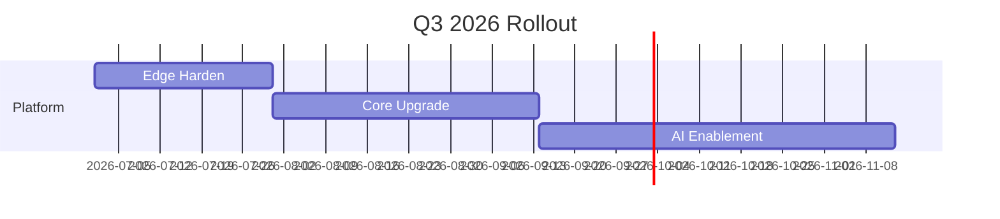

# فلاي قاكا (Fly GACA) — دليل أسلوب وتصميم المستندات
**الإصدار 1.0** – *آخر تحديث: 2026-06-16*  
*الجهة المسؤولة: فريق نظم التصميم في فلاي قاكا*  
*التصنيف: للاستخدام الداخلي فقط*

---

## جدول المحتويات
1. [نظرة عامة](#overview)
2. [المبادئ](#principles)
3. [الأسس البصرية](#visual-foundations)
   - [لوحة الألوان](#color-palette)
   - [الطباعة والخطوط](#typography)
   - [التباعد والتخطيط](#spacing--layout)
   - [الأيقونات والصور](#iconography--imagery)
4. [مكتبة المكوّنات (عناصر المستند)](#component-library-document-elements)
   - [أنماط الطباعة](#typography-styles)
   - [استخدام الألوان](#color-usage)
   - [بنى التخطيط](#layout-structures)
   - [القوائم وأنماط القوائم](#lists--lists-styles)
   - [الجداول](#tables)
   - [كتل الشيفرة والمحتوى التقني](#code-blocks--technical-content)
   - [المربّعات الجانبية والتنبيهات](#callouts--alerts)
   - [الصور والأيقونات والوسائط](#images-icons--media)
   - [الروابط والإحالات المرجعية](#hyperlinks--cross-references)
   - [الترويسات والتذييلات وأرقام الصفحات](#headers-footers--page-numbers)
   - [اعتبارات الوصول](#accessibility-considerations)
5. [إرشادات الاستخدام](#usage-guidelines)
   - [ما يُفعَل وما لا يُفعَل](#dos-and-donts)
   - [إرشادات خاصة بنوع المستند](#document-specific-guidance)
     - [Markdown](#markdown)
     - [Word (.docx)](#word-docx)
     - [PDF](#pdf)
     - [Excel (.xlsx)](#excel-xlsx)
     - [PowerPoint (.pptx)](#powerpoint-pptx)
6. [ملاحظات التنفيذ](#implementation-notes)
   - [رموز التصميم (design tokens)](#design-tokens)
   - [أنماط قالب Word](#word-template-styles)
   - [أنماط خلايا Excel وسماتها](#excel-cell-styles--themes)
   - [الشريحة الرئيسية في PowerPoint](#powerpoint-slide-master)
   - [إعدادات تصدير PDF](#pdf-export-settings)
   - [الأتمتة والتحقّق](#automation--validation)
7. [أمثلة](#examples)
   - [مقتطف Markdown](#markdown-snippet)
   - [نموذج مستند Word](#word-document-sample)
   - [تقرير مالي (Excel)](#financial-report-excel)
   - [شريحة عرض تقديمي (PowerPoint)](#presentation-slide-powerpoint)
   - [مثال على تصدير PDF](#pdf-export-example)
8. [سجلّ التغييرات](#changelog)
9. [الملحق: الملفات المرجعية](#appendixreference-files)

---

## نظرة عامة
يلتقط هذا الدليل الإحساس البصري والتجريبي لفلاي قاكا لجميع مستندات المكتب المُنتَجة داخل `/Users/flygaca/Documents/Fly GACA /The Office/`. وهو يوحّد دليل أسلوب مستندات Markdown القائم مع المواصفات على مستوى العلامة التجارية لـ Word وPDF وExcel وPowerPoint، بما يضمن أن يجسّد كل مخرَج — سواء كان مذكرة استراتيجية، أو عقدًا قانونيًّا، أو نموذجًا ماليًّا، أو عرضًا تقديميًّا — قيم فلاي قاكا الأساسية: **عصري، ونظيف، ونابض بالحياة، ومتمحور حول المستخدم**.

الدليل مبنيّ على *نظام التصميم لفلاي قاكا* (راجع `design-system.html` و`design-system.pdf`) و*ورقة الهوية التجارية لـ Fly GACA*. وهو يترجم الرموز المتمحورة حول واجهة المستخدم (اللون، والطباعة، والتباعد) إلى أنماط عملية على مستوى المستند مع الحفاظ على لغة التصميم الكامنة.

---

## المبادئ
| المبدأ | الوصف | التطبيق |
|-----------|-------------|-------------|
| **عصري** | خطوط نظيفة، وطباعة معاصرة، واستخدام هادف لألوان التمييز النابضة. | استخدم Inter/Cairo/JetBrains Mono؛ وتجنّب الخطوط الزخرفية؛ وأبقِ التخطيطات غير مزدحمة. |
| **واضح** | تسلسل هرمي للمعلومات يوجّه العين بشكل طبيعي؛ مع وزن بصري متّسق. | طبّق تسلسلًا هرميًّا واضحًا للعناوين؛ ومساحة بيضاء وافرة؛ ومحاذاة متّسقة. |
| **نابض بالحياة** | استخدام استراتيجي لسمة الصقر (Falcon) لإبراز المعلومات الرئيسية دون إغراق. | تُستخدم ألوان التمييز (Falcon Blue، Orange، Green، Red، Purple) باعتدال لدعوات الإجراء والتنبيهات والمقاييس. |
| **متمحور حول المستخدم** | إعطاء الأولوية للقابلية للقراءة، وسهولة المسح البصري، وإمكانية الوصول للجمهور الداخلي والخارجي. | حدّ أدنى لنص المتن 14 نقطة؛ وتباين WCAG AA؛ ونص بديل للصور؛ وترتيب قراءة منطقي. |

---

## الأسس البصرية
### لوحة الألوان
توفّر **سمة الصقر (Falcon Theme)** الخاصة بفلاي قاكا لوحةً متحفّظة وزاهية في آنٍ معًا، مُحسَّنة للشاشة والطباعة على حدّ سواء.

| اللون | Hex | إرشادات الاستخدام | الوصول (WCAG AA على الأبيض) |
|-------|-----|------------------|-----------------------------------|
| Falcon Blue | `#0066FF` | ألوان تمييز أساسية، وروابط، وإبرازات رئيسية | ✔️ 4.5:1 |
| Falcon Orange | `#FF6B35` | مربّعات جانبية، وتحذيرات، وملاحظات مهمة | ✔️ 4.5:1 |
| Falcon Green | `#00C853` | مؤشّرات النجاح، والمقاييس الإيجابية | ✔️ 4.5:1 |
| Falcon Red | `#FF3D00` | الأخطاء، والتنبيهات الحرجة، والقيم المالية السالبة | ✔️ 4.5:1 |
| Falcon Purple | `#9D4EDD` | الرؤى الاستراتيجية، وعلامات الابتكار | ✔️ 4.5:1 |
| Dark Charcoal (المتن) | `#2D3748` | نص المتن الأساسي | ✔️ 7.2:1 |
| Medium Gray | `#4A5568` | النص الثانوي، والعناوين الفرعية | ✔️ 4.6:1 |
| Light Gray | `#718096` | النص الثالثي، والحواشي (≤20% من الحجم) | ✔️ 3.2:1 (يُستخدم للتأكيد المنخفض فقط) |
| Border Gray | `#E2E8F0` | الجداول، والفواصل، وخلفيات كتل الشيفرة | لا ينطبق |
| White | `#FFFFFF` | خلفية المستند | لا ينطبق |

**القواعد**
1. **لون النص** – يجب أن يكون النص الأساسي Dark Charcoal على الأبيض؛ وألّا يكون أسود خالصًا أبدًا (`#000000`). يجوز استخدام Light Gray للحواشي أو النص المساعد، لكن يجب ألّا يتجاوز 20% من إجمالي حجم النص.
2. **حدود ألوان التمييز** – بحدّ أقصى **لونان للتمييز** لكل قسم من المستند. ويُحجَز Falcon Blue للإجراءات/الروابط الأساسية. ويُقتصَر Falcon Orange على **3 مواضع في الصفحة** للتنبيهات عالية الأولوية. ويُستخدم Falcon Green/Red **فقط** لنقل حالة إيجابية/سالبة واضحة (وليس للزخرفة أبدًا).
3. **الخلفيات** – خلفية المستند الرئيسية بيضاء. كتل الشيفرة: خلفية Border Gray مع حشوة 1 بكسل. مربّعات الجانب: درجة بنسبة 10٪ من لون التمييز (مثلًا Falcon Blue ← `#E6F0FF`).
4. **إمكانية الوصول** – يجب أن يفي كل نص بنسب تباين WCAG AA. ولا تعتمد على اللون وحده أبدًا لنقل المعلومة؛ بل اقرنه بأيقونات أو علامات نصية. وتحقّق من العرض بالتدرّج الرمادي للمستندات المطبوعة.

### الطباعة والخطوط
توظّف فلاي قاكا نظامًا ثلاثي الخطوط مضبوطًا للوضوح على الوسائط الرقمية والمطبوعة على حدّ سواء.

| الغرض | الخط | متغيّرات الوزن | الاستخدامات المعتادة |
|---------|------|-----------------|--------------|
| **متن أساسي** | Inter | 400 (Regular)، 500 (Medium)، 600 (SemiBold) | نص الفقرات، ومحتويات الجداول، وعناصر القوائم |
| **العناوين والتمييزات** | Cairo | 600 (SemiBold)، 700 (Bold)، 800 (ExtraBold) | عناوين المستند، وعناوين الأقسام، والمربّعات الجانبية |
| **الشيفرة والمحتوى التقني** | JetBrains Mono | 400 (Regular)، 500 (Medium) | الشيفرة المضمَّنة، وكتل الشيفرة، ومسارات الملفات، ومخرجات الأوامر |

#### التسلسل الهرمي والأحجام (قيم بالنقاط ← قيم بالبكسل التقريبية عند 96 dpi)
| السياق | الخط | الحجم (نقطة) | الحجم (بكسل) | الوزن |
|---------|------|-----------|-----------|--------|
| عنوان المستند | Cairo | 32 نقطة | 43 بكسل | 800 ExtraBold |
| عنوان القسم | Cairo | 24 نقطة | 32 بكسل | 700 Bold |
| عنوان قسم فرعي | Cairo | 20 نقطة | 27 بكسل | 600 SemiBold |
| عنوان قسم فرعي تحت فرعي | Cairo | 18 نقطة | 24 بكسل | 600 SemiBold |
| نص المتن | Inter | 14 نقطة | 19 بكسل | 400 Regular |
| تمييز عريض | Inter | 14 نقطة | 19 بكسل | 600 SemiBold |
| تمييز مائل | Inter | 14 نقطة | 19 بكسل | 400 Regular *مائل* |
| شيفرة مضمَّنة | JetBrains Mono | 13 نقطة | 17 بكسل | 400 Regular |
| متن كتلة الشيفرة | JetBrains Mono | 13 نقطة | 17 بكسل | 400 Regular |

**حالات خاصة**
- **المستندات القانونية** – استخدم Cairo 700 لأرقام البنود (مثل "3.2.").
- **التقارير المالية** – JetBrains Mono لجميع المبالغ النقدية، ورموز الحسابات، والمعرّفات.
- **مستندات الاستراتيجية** – Cairo 800 لبيانات الرؤية والركائز الاستراتيجية.
- **الحدّ الأدنى لإمكانية الوصول** – لا يقلّ نص المتن أبدًا عن 14 نقطة (≈19 بكسل).

### التباعد والتخطيط
يلتزم كل تباعد بـ **شبكة من 8 بكسلات** لإيجاد انسجام إيقاعي رأسي وأفقي.

| الوحدة | القيمة | التطبيق |
|------|-------|-------------|
| التباعد الأساسي | 8 بكسل | مقادير الهامش/الحشوة |
| ارتفاع السطر | 1.5 | نص المتن (21 بكسل لخط 14 نقطة) |
| تباعد الفقرات | 16 بكسل | بين الفقرات |
| تباعد الأقسام | 32 بكسل | بين الأقسام الرئيسية |
| تباعد الكتل | 24 بكسل | حول كتل الشيفرة والاقتباسات والجداول |

#### مواصفات التخطيط
- **هوامش الصفحة**  
  - رقمي: 40 بكسل (5 وحدات) على جميع الجوانب.  
  - طباعة: 0.75 بوصة (≈54 بكسل) لاستيعاب التجليد.
- **عرض العمود**  
  - أمثل قابلية للقراءة: 65–75 حرفًا في السطر.  
  - أقصى عرض للمستندات الرقمية: 800 بكسل (100 وحدة).
- **الإزاحة**  
  - القوائم: 16 بكسل (وحدتان).  
  - القوائم المتداخلة: +16 بكسل لكل مستوى.  
  - كتل الشيفرة: 0 بكسل إزاحة يسارية (بكامل العرض داخل الحاوية).
- **الفواصل الأفقية**  
  - الارتفاع: 1 بكسل.  
  - اللون: Border Gray (`#E2E8F0`).  
  - الهامش: 32 بكسل أعلى وأسفل.

#### بنية المستند (مثال متمحور حول Markdown، قابل للتكييف مع صيغ أخرى)
```
# Title (Cairo 800, 32 pt)   ← 32 px space below

## Section 1 (Cairo 700, 24 pt)   ← 24 px space below
[Body text with 16 px paragraph spacing]

### Subsection (Cairo 600, 20 pt)   ← 20 px space below
[Content]

> [Blockquote: 24 px margin top/bottom, 16 px padding, leftBorder 3 px Falcon Blue]

```[language]
[Code block: 24 px margin top/bottom, 16 px padding, Background Border Gray]
```

## Section 2 (Cairo 700, 24 pt)   ← 32 px space above
```
```

### الأيقونات والصور
- **أسلوب الأيقونات** – استخدم مجموعة أيقونات خطية بسماكة 2 بكسل، بلون Falcon Blue (`#0066FF`) للحالات النشطة، وFalcon Orange (`#FF6B35`) للتحذيرات. وينبغي أن تكون الأيقونات 24 × 24 بكسل (تُحجَّم إلى 16 بكسل أو 32 بكسل حسب الحاجة) وتُصدَّر بصيغة SVG للحصول على عرض حادّ.
- **معالجة الصور**  
  - أدرِج دائمًا نصًّا وصفيًّا `alt`.  
  - أقصى عرض: 600 بكسل (رقمي) أو 5 بوصات (طباعة).  
  - الصيغ المفضّلة: SVG (الشعارات والأيقونات)، وPNG (لقطات الشاشة والمخطّطات)، وJPEG (الصور الفوتوغرافية).  
  - طبّق إطارًا خفيفًا بسماكة 1 بكسل بلون Border Gray (`#E2E8F0`) عندما تستقرّ الصور على خلفية بيضاء لتحسين الفصل.
- **التصوير الفوتوغرافي** – استخدم لقطات أصيلة عالية الدقّة لفرق فلاي قاكا ومرافقها وعملائها. وطبّق ميلًا دافئًا طفيفًا (حرارة +250 كلفن) لتنسجم مع خلفية Falcon Ivory (`#F5F2ED`) المستخدمة في نظام التصميم الرقمي، لكن أبقِ خلفيات المستند بيضاء خالصة للتباين.

---

## مكتبة المكوّنات (عناصر المستند)
تشكّل العناصر التالية "المكوّنات" القابلة لإعادة الاستخدام في مستند فلاي قاكا. وتُقدَّم المواصفات بشكل محايد عن الصيغة؛ أما التعيينات الخاصة بكل صيغة فتظهر في قسم **ملاحظات التنفيذ**.

### أنماط الطباعة
| النمط | الخط | الحجم | الوزن | اللون | الاستخدام |
|-------|------|------|--------|-------|-------|
| H1 – عنوان المستند | Cairo | 32 نقطة | 800 | Dark Charcoal (`#2D3748`) | العنوان الأعلى مستوى |
| H2 – عنوان القسم | Cairo | 24 نقطة | 700 | Dark Charcoal | عنوان القسم |
| H3 – عنوان قسم فرعي | Cairo | 20 نقطة | 600 | Dark Charcoal | القسم الفرعي |
| H4 – عنوان قسم فرعي تحت فرعي | Cairo | 18 نقطة | 600 | Dark Charcoal | عنوان أدنى مستوى |
| المتن | Inter | 14 نقطة | 400 | Dark Charcoal | نص الفقرات |
| المتن العريض | Inter | 14 نقطة | 600 | Dark Charcoal | تمييز مضمَّن |
| المتن المائل | Inter | 14 نقطة | 400 *مائل* | Dark Charcoal | تمييز مضمَّن |
| شيفرة مضمَّنة | JetBrains Mono | 13 نقطة | 400 | Falcon Blue (`#0066FF`) | مسارات الملفات، والأوامر |
| كتلة شيفرة | JetBrains Mono | 13 نقطة | 400 | النص: Dark Charcoal؛ الخلفية: Border Gray (`#E2E8F0`) | مقتطفات الشيفرة |
| التسمية التوضيحية | Inter | 12 نقطة | 400 | Light Gray (`#718096`) | تسميات الأشكال/الجداول |
| الحاشية | Inter | 12 نقطة | 400 | Light Gray (`#718096`) | نص الحاشية |

### استخدام الألوان (لكل عنصر)
- **العناوين**: Dark Charcoal؛ مع تسطير تمييز اختياري (2 بكسل) بلون Falcon Blue لـ H1 فقط.
- **نص المتن**: Dark Charcoal؛ والروابط: Falcon Blue مع تسطير.
- **الروابط**: Falcon Blue (`#0066FF`)، مع تسطير؛ والمزارة: Falcon Blue بعتامة 80٪.
- **ترويسة الجدول**: الخلفية: درجة Falcon Blue بنسبة 10٪ (`#E6F0FF`)؛ النص: Dark Charcoal؛ عريض.
- **متن الجدول**: تظليل صفوف متناوب: White / درجة Falcon Blue بنسبة 5٪ (`#F3F8FF`).
- **المربّع الجانبي**: الخلفية: درجة بنسبة 10٪ من لون التمييز (مثلًا Falcon Blue ← `#E6F0FF`)؛ الحدّ الأيسر: 3 بكسل صلب بلون التمييز.
- **متغيّرات التنبيه** (باستخدام صياغة الاقتباس):
  - [!NOTE] – حدّ Falcon Blue، الخلفية `#E6F0FF`.
  - [!TIP] – حدّ Falcon Green، الخلفية `#E6FFE6`.
  - [!IMPORTANT] – حدّ Falcon Orange، الخلفية `#FFF8F0`.
  - [!WARNING] – حدّ Falcon Red، الخلفية `#FFEEEE`.
  - [!CAUTION] – حدّ Falcon Purple، الخلفية `#F7EEFF`.
- **كتلة الشيفرة**: الخلفية Border Gray (`#E2E8F0`)؛ النص Dark Charcoal.
- **الفاصل الأفقي**: بسماكة 1 بكسل، بلون Border Gray (`#E2E8F0`).

### بنى التخطيط
- **عمود واحد** – الافتراضي لمعظم المستندات (المذكرات، والتقارير، والمقترحات).
- **عمودان** – يُحجَز لتخطيطات بعينها (مثل تحليل SWOT، أو الإيجابيات/السلبيات، أو المسارد). عرض العمود: 48٪ لكلٍّ مع فاصل 4٪؛ والعرض الإجمالي ≤ 800 بكسل.
- **ثلاثة أعمدة** – استخدام محدود جدًّا (مثل استراتيجية الركائز الثلاث). كل عمود ≤ 30٪؛ والفاصل 5٪.
- **قائم على الشبكة** – للجداول أو لوحات المعلومات المعقّدة؛ محاذاة إلى فواصل من 8 بكسلات.

### القوائم وأنماط القوائم
| النوع | العلامة | الإزاحة | التباعد |
|------|--------|--------|---------|
| غير مرتّبة | شرطة (`-`) | 16 بكسل (وحدتان) | 8 بكسل بين العناصر |
| مرتّبة | رقم + نقطة (`1.`) | 16 بكسل (وحدتان) | 8 بكسل بين العناصر |
| قائمة مهام | `- [ ]` / `- [x]` | 16 بكسل (وحدتان) | 8 بكسل بين العناصر |
| المستويات المتداخلة | زِد الإزاحة بمقدار 16 بكسل لكل مستوى | أقصى عمق 3 | — |

### الجداول
- **صف الترويسة**: نص عريض، بخلفية درجة Falcon Blue بنسبة 10٪ (`#E6F0FF`).
- **نص المتن**: نص محاذاته يسارية، وأرقام محاذاتها يمينية.
- **تخطيط الصفوف** (اختياري): صفوف متناوبة White / درجة Falcon Blue بنسبة 5٪ (`#F3F8FF`).
- **الحدود**: سماكة 1 بكسل، بلون Border Gray (`#E2E8F0`) بين الخلايا؛ ولا حدّ خارجي إلا إذا لزم لنماذج الطباعة.
- **عرض العمود**: يُضبَط ليلائم المحتوى؛ بأقصى عرض للخلية 80 حرفًا (مع الالتفاف عند الحاجة).
- **تنسيق الأرقام**: استخدم رموز عملة وأماكن عشرية وفواصل آلاف متّسقة.
- **إمكانية الوصول**: تأكّد من نطاق الترويسة؛ ووفّر ملخّصًا/تسمية توضيحية للجداول المعقّدة.

### كتل الشيفرة والمحتوى التقني
- صرّح دائمًا باللغة (مثل ````bash````).
- الخلفية: Border Gray (`#E2E8F0`).
- الحشوة: 12 بكسل أعلى/أسفل، و16 بكسل يسار/يمين.
- الخط: JetBrains Mono 13 نقطة.
- لا أرقام أسطر إلا إذا لزمت للإحالة؛ وإن استُخدمت، فضعها في الهامش الأيسر بلون Light Gray (`#718096`).

### المربّعات الجانبية والتنبيهات
تُنفَّذ بوصفها اقتباسات بحدّ أيسر ملوّن وخلفية مُدرَّجة (راجع استخدام الألوان). استخدم صياغة Markdown:
```
> [!NOTE]
> This is a note.
```
بالنسبة إلى Word/PowerPoint، استخدم مربّع نص مظلَّل بشريط تمييز أيسر.

### الصور والأيقونات والوسائط
- **الصور**: أدرِج بـ ``؛ واضبط خاصية العرض عند الحاجة (`{width=600px}` في Markdown).  
- **الأيقونات**: فضّل SVG مضمَّنًا؛ مع الرجوع إلى PNG بخلفية شفافة. الحجم: 24 بكسل (ارتفاع) بمحاذاة ارتفاع السطر.
- **الوسائط (صوت/فيديو)** – غير معتادة في المستندات الساكنة؛ وإن لزمت، فضمّن رمز QR يربط بالوسائط المستضافة على بوابة فلاي قاكا الداخلية، مع تسمية توضيحية "امسح لعرض الفيديو".

### الروابط والإحالات المرجعية
- **النمط**: Falcon Blue (`#0066FF`)، مع تسطير.  
- **التحويم/التركيز** (رقمي): سماكة التسطير 2 بكسل، مع تحوّل اللون إلى Falcon Blue بعتامة 80٪.  
- **تنسيق الإحالة المرجعية**: استخدم نصًّا وصفيًّا، ولا تستخدم روابط خامًّا أبدًا.  
   - جيد: `[Flygaca Brand Guidelines](https://flygaca.com/brand)`  
   - تجنّب: `Click here` أو `https://flygaca.com/brand`.

### الترويسات والتذييلات وأرقام الصفحات
- **الترويسة** (اختيارية): عنوان المستند بمحاذاة يسارية، وعنوان القسم بمحاذاة يمينية؛ بخط Inter 12 نقطة، بلون Medium Gray (`#4A5568`).  
- **التذييل**: رقم الصفحة في الوسط، بخط Inter 12 نقطة، بلون Light Gray (`#718096`)؛ ويُنسَّق إجمالي الصفحات بصيغة "Page X of Y".  
- **تخطيط الصفحة الأولى**: غالبًا بلا ترويسة/تذييل لصفحات العنوان؛ ويُدرَج علامة مائية للسرّية عند الحاجة (Falcon Gray بعتامة 5٪ قطريًّا).  
- **العلامة المائية** (المسودّات): "DRAFT" بلون Falcon Blue بزاوية 45°، بحجم 120 نقطة، بعتامة 10٪.

### اعتبارات الوصول
1. **التباين** – تحقّق من أنّ جميع أزواج النص/الخلفية تفي بـ WCAG AA (بحدّ أدنى 4.5:1).  
2. **تكبير الخط** – تأكّد من بقاء المستندات مقروءة عند التكبير/التحجيم حتى 200٪.  
3. **ترتيب القراءة** – تسلسل هرمي منطقي للعناوين؛ وتجنّب تخطّي مستويات العناوين.  
4. **النص البديل** – يجب أن يكون لكل صورة أو أيقونة أو عنصر غير نصّي نص `alt` وصفي.  
5. **عمى الألوان** – لا تعتمد على تمييزات اللون وحدها؛ بل اقرنها بأنماط (مثل تخطيط الجداول) أو أيقونات.  
6. **ملفات PDF القابلة للوصول** – وسِم العناوين، وحدّد لغة المستند، وفعّل الوسوم البنيوية للجداول والقوائم.  
7. **فحص إمكانية الوصول** – شغّل الفاحص المدمج (Word: "Check Accessibility"؛ Acrobat: "Full Check") قبل التوزيع النهائي.

---

## إرشادات الاستخدام
### ما يُفعَل وما لا يُفعَل
| يُفعَل | لا يُفعَل |
|----|-------|
| استخدم ألوان تمييز لوحة الصقر بهدف وباعتدال. | تطبيق ألوان زاهية متعدّدة في الفقرة نفسها؛ مما يُحدِث تأثير "قوس قزح". |
| التزم بـ Inter/Cairo/JetBrains Mono لكل المتن والعناوين والشيفرة. | مزج خطوط زخرفية (مثل Comic Sans، Papyrus) أو افتراضيات النظام المخالِفة. |
| حافظ على تباعد الفقرات والأقسام المبني على 8 بكسلات. | استخدام تباعد اعتباطي (مثل 10 نقاط، 24 نقطة) يكسر الشبكة. |
| حاذِ الأرقام إلى اليمين والنص إلى اليسار في الجداول. | محاذاة الأعمدة الرقمية إلى الوسط؛ مما يعيق المسح السريع. |
| وفّر نصًّا بديلًا وصفيًّا لكل صورة. | ترك `alt` فارغًا أو استخدام حشو لا معنى له مثل "image123". |
| استخدم مستويات عناوين دلالية (H1 ← H2 ← H3) دون تخطٍّ. | القفز من H1 إلى H4 لفرض حجم بصري؛ وإساءة استخدام وسوم العناوين للتنسيق. |
| صدّر النسخ النهائية بصيغة PDF/A‑1b للتوزيع الأرشيفي. | توزيع ملف .docx قابل للتحرير كنسخة نهائية عند عدم اللزوم؛ مما يخاطر بانحراف الإصدارات. |
| أدرِج تذييل سرّية عند التعامل مع بيانات حسّاسة. | إغفال العلامات على المستندات المصنَّفة أو المملوكة. |

### إرشادات خاصة بنوع المستند
#### Markdown
- اتّبع *دليل أسلوب مستندات Fly GACA* القائم (راجع `fly-gaca-document-style-guide.md`) بوصفه خطّ الأساس.  
- وسّعه بتعيينات الرموز المحدَّدة في هذا الدليل (الألوان، والتباعد، واستخدام الأيقونات).  
- استخدم YAML في المقدّمة (front‑matter) للبيانات الوصفية عند التخزين في مستودع:
  ```yaml
  ---
  title: "Document Title"
  type: "strategy"
  version: "v01"
  last_updated: "2026-06-16"
  author: "@username"
  tags: [strategy, quarterly]
  ---
  ```
- تحقّق بـ `markdownlint` باستخدام مجموعة قواعد فلاي قاكا (طول السطر 100، عناوين ATX، إزاحة قوائم بمسافتين، أسوار لغة مطلوبة، بلا مسافات بيضاء زائدة، وبحدّ أقصى 3 أسطر فارغة).

#### Word (.docx)
- **القالب**: استخدم `Flygaca_Doc_Template.dotx` (المخزَّن في `/templates/`).  
- **الأنماط**: عيّن جدول أنماط الطباعة إلى أنماط Word (Heading 1، Heading 2، Normal، Code، إلخ). واضبط أحجام الخطوط تمامًا كما هو محدَّد (نقطة).  
- **الألوان**: عرّف ألوان سمة مخصّصة مطابِقة للوحة الصقر؛ وطبّقها على الروابط، وترويسات الجداول، وأشكال المربّعات الجانبية.  
- **التباعد**: اضبط "Paragraph → Spacing → Before/After" إلى 16 نقطة للفقرات، و32 نقطة للأقسام (باستخدام تباعد أسطر "Multiple" 1.5).  
- **الترويسات/التذييلات**: أدرِج عبر "Insert → Header/Footer"؛ باستخدام Inter 12 نقطة، ودرجات رمادية حسب الدليل.  
- **إمكانية الوصول**: شغّل "Review → Check Accessibility" قبل الحفظ.  
- **الحفظ**: احفظ النسخة الأصلية بصيغة `.docx`؛ ووزّع النسخة النهائية بصيغة PDF عبر "Export → Create PDF/XPS Document" (اختر PDF/A‑1b).

#### PDF
- **المصدر**: فضّل التصدير من Word أو Markdown عبر Pandoc بقالب CSS الخاص بفلاي قاكا (راجع `pandoc/flygaca.template.html`).  
- **الوسوم**: فعّل توافق PDF/A‑1b؛ ووسِم العناوين (H1‑H6)، والفقرات، والقوائم، والجداول.  
- **الروابط**: تأكّد من وجود حواشي عناوين URL وتلوينها بلون Falcon Blue.  
- **العلامات المرجعية**: ولّدها تلقائيًّا من العناوين لجزء التنقّل.  
- **الأمن**: طبّق الحماية بكلمة مرور فقط إذا لزم؛ وإلا فاتركه مفتوحًا للمشاركة الداخلية.  
- **التحقّق**: استخدم Acrobat Pro "Accessibility Full Check" و"Preflight" (PDF/A‑1b).

#### Excel (.xlsx)
- **سمة المصنّف**: أنشئ سمة مخصّصة بألوان الصقر (Accent 1‑6 معيَّنة إلى Blue، Orange، Green، Red، Purple، Gray).  
- **أنماط الخلايا**:
  - **العنوان**: Cairo 24 نقطة Bold، Dark Charcoal، تعبئة درجة Falcon Blue بنسبة 10٪.
  - **العنوان الفرعي**: Cairo 18 نقطة Bold، Dark Charcoal.
  - **المتن**: Inter 11 نقطة (≈14 بكسل)، Dark Charcoal.
  - **الرقم**: JetBrains Mono 11 نقطة، Dark Charcoal، بتنسيق Currency/Number بخانتين عشريتين.
  - **التحذير**: نص Falcon Orange، تعبئة درجة Falcon Orange بنسبة 10٪.
  - **النجاح**: نص Falcon Green، تعبئة درجة Falcon Green بنسبة 10٪.
- **عرض العمود**: يُضبَط ليلائم المحتوى؛ بهدف ≤ 15 حرفًا لأعمدة المعرّفات، و≥ 12 للنص الوصفي.  
- **ارتفاع الصف**: الافتراضي 15 نقطة؛ مع تفعيل "Wrap text" حيثما لزم.  
- **الجداول**: نسّق كجدول Excel مع "BandRows" متناوبة White / درجة Falcon Blue بنسبة 5٪.  
- **المخطّطات**: استخدم لوحة الصقر للسلاسل؛ وطبّق تعبئات نمطية (خطوط، نقاط) للطباعة بالأبيض والأسود؛ وتجنّب التأثيرات ثلاثية الأبعاد.  
- **منطقة الطباعة**: اضبط الهوامش إلى 0.75 بوصة؛ وفعّل "Fit to Page" عرضًا عند الحاجة.  
- **الحماية**: اقفل البنية؛ واسمح بتحرير خلايا الإدخال فقط.

#### PowerPoint (.pptx)
- **الشريحة الرئيسية**: حرّر `Flygaca_Slide_Master.master` (في `/templates/`).  
  - **عنصر نائب للعنوان**: Cairo 32 نقطة، 800، Dark Charcoal.  
  - **عنصر نائب للمحتوى**: Inter 18 نقطة، 400، Dark Charcoal (المتن)؛ Inter 20 نقطة، 600، Dark Charcoal (العنوان الفرعي).  
  - **التذييل**: Inter 12 نقطة، Light Gray (`#718096`)؛ ويتضمّن رقم الشريحة والتاريخ.  
- **ألوان السمة**: عرّف ألوانًا مخصّصة مطابِقة للوحة الصقر؛ وطبّقها على الأشكال، وSmartArt، وسلاسل المخطّطات.  
- **الخلفية**: بيضاء (`#FFFFFF`) لشرائح المحتوى؛ وقد تستخدم شريحة العنوان تدرّج Falcon Blue خفيفًا (أعلى 10٪ من الارتفاع) لإضافة اهتمام بصري.  
- **التباعد**: استخدم تباعدًا رأسيًّا مشتقًّا من 8 بكسلات: اضبط "Line spacing" إلى 1.5؛ و"Space Before/After" للفقرات إلى 12 نقطة (المتن) و24 نقطة (عناوين الأقسام).  
- **الصور**: اضبط "Compress pictures" إلى 150 ppi للعرض على الشاشة؛ و300 ppi للطباعة.  
- **إمكانية الوصول**: استخدم "Review → Check Accessibility"؛ واضبط ترتيب القراءة عبر Selection Pane؛ وأضِف نصًّا بديلًا لجميع الصور والأشكال.  
- **التصدير**: احفظ بصيغة PDF عبر "Export → Create PDF/XPS Document" (PDF/A‑1b) للتوزيع؛ وأبقِ ملف .pptx للتحرير.

---

## ملاحظات التنفيذ
### رموز التصميم (design tokens)
| اسم الرمز | القيمة | الاستخدام |
|------------|-------|-------|
| `color-falcon-blue` | `#0066FF` | الروابط، وألوان التمييز الأساسية |
| `color-falcon-orange` | `#FF6B35` | التحذيرات، والمربّعات الجانبية |
| `color-falcon-green` | `#00C853` | النجاح، والإيجابي |
| `color-falcon-red` | `#FF3D00` | الأخطاء، والقيم السالبة |
| `color-falcon-purple` | `#9D4EDD` | الاستراتيجية، والابتكار |
| `color-neutral-dark` | `#2D3748` | نص المتن |
| `color-neutral-medium` | `#4A5568` | النص الثانوي |
| `color-neutral-light` | `#718096` | النص الثالثي، والحواشي |
| `color-neutral-border` | `#E2E8F0` | حدود الجداول، وخلفية الشيفرة |
| `color-neutral-base` | `#FFFFFF` | خلفية الصفحة |
| `font-body` | `Inter, system-ui, sans-serif` | نص المتن |
| `font-heading` | `Cairo, system-ui, sans-serif` | العناوين |
| `font-code` | `'JetBrains Mono', monospace` | الشيفرة، والتقني |
| `size-text-base` | `14pt` | المتن |
| `size-heading-h1` | `32pt` | عنوان المستند |
| `size-heading-h2` | `24pt` | القسم |
| `size-heading-h3` | `20pt` | القسم الفرعي |
| `size-heading-h4` | `18pt` | تحت الفرعي |
| `size-code` | `13pt` | الشيفرة المضمَّنة والكتلية |
| `spacing-unit` | `8px` | الشبكة الأساسية |
| `spacing-paragraph` | `16px` | فجوة الفقرة |
| `spacing-section` | `32px` | فجوة القسم |
| `spacing-block` | `24px` | حول الكتل |
| `radius-none` | `0px` | بلا نصف قطر (افتراضي) |
| `radius-sm` | `4px` | زوايا مدوّرة صغيرة (المربّعات الجانبية) |
| `shadow-none` | `none` | بلا ظلّ |
| `shadow-sm` | `0 1px 2px rgba(0,0,0,0.05)` | ارتفاع خفيف (بطاقات التنبيه) |

يمكن تصدير هذه الرموز بصيغة JSON للاستخدام في البرمجة النصية (مثل مرشّحات Pandoc، أو توليد Office Open XML).

### أنماط قالب Word
أنشئ ملف `.dotx` بتعيينات الأنماط التالية (مقتطف):
- **Heading 1** ← الخط Cairo، الحجم 32 نقطة، Bold، اللون Dark Charcoal، تباعد بعده 24 نقطة.
- **Heading 2** ← الخط Cairo، الحجم 24 نقطة، Bold، اللون Dark Charcoal، تباعد بعده 16 نقطة.
- **Heading 3** ← الخط Cairo، الحجم 20 نقطة، Bold، اللون Dark Charcoal، تباعد بعده 12 نقطة.
- **Normal** ← الخط Inter، الحجم 14 نقطة، اللون Dark Charcoal، تباعد أسطر 1.5، تباعد بعده 12 نقطة.
- **Code** ← الخط JetBrains Mono، الحجم 13 نقطة، اللون Dark Charcoal، تظليل Border Gray، إزاحة يسار 0 نقطة، يمين 0 نقطة، تباعد قبله/بعده 12 نقطة.
- **Hyperlink** ← الخط مع تسطير، اللون Falcon Blue، نمط تسطير مفرد.
- **[مخصّص] المربّع الجانبي** ← الشكل: مستطيل، تعبئة درجة بنسبة 10٪ من التمييز، خطّ 3 نقاط صلب بلون التمييز، التفاف النص: Square.

### أنماط خلايا Excel وسماتها
- عرّف ملف **Theme Colors** مخصّصًا (`Flygaca_Theme.xml`) يعيّن فتحات اللوحة الـ12 إلى ألوان الصقر + المحايدة.
- أنشئ **أنماط خلايا**:
  - `Tbl_Header` ← الخط Cairo 14 نقطة Bold، تعبئة درجة Falcon Blue بنسبة 10٪، لون الخط Dark Charcoal، حدّ سفلي 1 نقطة Border Gray.
  - `Num_Body` ← الخط JetBrains Mono 11 نقطة، تنسيق الأرقام `_(* #,##0.00_);_(* (#,##0.00);_(* "-"??_);_(@_)`، تعبئة بلا لون.
  - `Alert_Warning` ← الخط Inter 11 نقطة Bold، اللون Falcon Orange، تعبئة درجة Falcon Orange بنسبة 10٪.
  - `Alert_Success` ← الخط Inter 11 نقطة Bold، اللون Falcon Green، تعبئة درجة Falcon Green بنسبة 10٪.

### الشريحة الرئيسية في PowerPoint
- **الشريحة الرئيسية للعنوان**: خلفية بيضاء؛ عنصر نائب للعنوان كما سبق؛ مع مستطيل Falcon Blue زخرفي اختياري (ارتفاع 20 نقطة) في الأسفل.
- **الشريحة الرئيسية للمحتوى**: خلفية بيضاء؛ وتنسيق نص العناصر النائبة حسب أنماط الطباعة.
- **الشريحة الرئيسية للتذييل**: Inter 12 نقطة، Light Gray، بمحاذاة يسارية "Confidential – Flygaca"، وبمحاذاة يمينية رقم الشريحة والتاريخ.
- **ألوان السمة**: نفس رموز التصميم.

### إعدادات تصدير PDF
- **من Word**: Options ← توافق ISO 19005‑1 (PDF/A)؛ نصّ نقطي عند عدم تضمين الخطوط؛ إنشاء علامات مرجعية من العناوين.
- **من Pandoc**: `--pdf-engine=xelatex -V geometry:margin=0.75in -V titleblock:true -V fontsize:11pt -V linestretch:1.5`.
- **التحقّق**: استخدم `veraPDF` أو Acrobat Preflight PDF/A‑1b.

### الأتمتة والتحقّق
- **الفحص اللغوي (Linting)**:  
  - Markdown: `markdownlint -c .markdownlint.json **/*.md`  
  - Word: استخدم `docx‑linter` (مخصّص) للتحقّق من أسماء الأنماط.  
  - Excel: شغّل نصًّا برمجيًّا بـ VBA للتحقّق من تطبيق السمة المخصّصة وعدم وجود تجاوزات يدوية.  
  - PowerPoint: استخدم Office JavaScript API للتحقّق من تعديلات الشريحة الرئيسية.
- **إدارة الإصدارات**: افرض نمط تسمية الملفات `[dept]_[doctype]_[YYYYMMDD]_[v##].[extension]` (راجع اصطلاح التسمية أدناه).
- **سجلّ التغييرات**: ينبغي أن يحتفظ كل مستند بسجلّ مراجعة موجز في نهايته (راجع المثال).

---

## أمثلة
### مقتطف Markdown
```markdown
# Q3 2026 Strategy Refresh

## Vision Statement
> [!TIP]
> Empowering global teams with secure, low‑latency connectivity.

### Strategic Pillars
| Pillar | Goal | Metric (Target) |
|--------|------|-----------------|
| **Secure Edge** | Zero‑trust perimeter | `100%` device compliance [Falcon Green] |
| **Low‑Latency Core** | Sub‑10 ms intra‑region | `<10 ms` [Falcon Blue] |
| **AI‑Ready Fabric** | GPU‑enabled nodes | `200` nodes [Quarterly] |

### Implementation Roadmap


*Last updated: 2026-06-16 | Version: v02*
```

### نموذج مستند Word
*(وصف للمنفّذين)*  
- **العنوان**: "Flygaca Q2 2026 Financial Report" (Heading 1، Cairo 32 نقطة، Dark Charcoal، 24 نقطة مسافة أسفله).  
- **القسم**: "Revenue Summary" (Heading 2، Cairo 24 نقطة، Dark Charcoal، 16 نقطة مسافة أسفله).  
- **المتن**: Inter 14 نقطة، Dark Charcoal، تباعد أسطر 1.5.  
- **الجدول**: تعبئة الترويسة `#E6F0FF`، نص Dark Charcoal عريض؛ صفوف المتن متناوبة White / `#F3F8FF`؛ الأرقام بمحاذاة يمينية، JetBrains Mono 12 نقطة.  
- **المربّع الجانبي**: مربّع مظلَّل، شريط أيسر Falcon Orange (`#FF6B35`)، خلفية `#FFF8F0`، النص "Note: Figures are preliminary."  
- **التذييل**: Inter 12 نقطة، Light Gray، يسار "Confidential – Flygaca"، يمين "Page 3 of 12".  

### تقرير مالي (Excel)
- **عنوان الورقة**: الخلية A1 مدمجة عبر A:G، "Q2 2026 Financial Performance" (نمط Heading 1).  
- **ترويسات الأعمدة**: الصف 3، تعبئة `#E6F0FF`، Dark Charcoal عريض، حدود سفلية 1 نقطة Border Gray.  
- **متن البيانات**: من الصف 4 فما دون، JetBrains Mono للأرقام (`$1.2M`)، Inter للتسميات.  
- **التنسيق الشرطي**:  
  - تعبئة خضراء (`#E6FFE6`) إذا كان الانحراف > 0.  
  - تعبئة حمراء (`#FFEEEE`) إذا كان الانحراف < 0.  
- **المخطّط**: مخطّط أعمدة يقارن الفعلي بالمتوقَّع؛ ألوان السلاسل Falcon Blue (الفعلي)، Falcon Green (الانحراف الإيجابي)، Falcon Red (الانحراف السلبي)؛ مع عرض تسميات البيانات؛ ووسيلة الإيضاح في الأسفل.  
- **إعداد الصفحة**: هوامش 0.75 بوصة، اتجاه أفقي (Landscape)، ملاءمة العرض لصفحة واحدة.  

### شريحة عرض تقديمي (PowerPoint)
- **نوع الشريحة**: عنوان + محتوى.  
- **العنوان**: "Q3 2026 Product Launch" (Cairo 32 نقطة، Dark Charcoal، في الوسط).  
- **تخطيط المحتوى**: عمودان.  
  - **العمود الأيسر**: قائمة نقطية، Inter 18 نقطة، Dark Charcoal، تباعد أسطر 1.4؛ أيقونات علامة صحّ (Falcon Green) قبل كل عنصر مكتمل.  
  - **العمود الأيمن**: نموذج صورة (بأقصى عرض 5 بوصات)، مع تسمية توضيحية Inter 12 نقطة، Light Gray، في الوسط أسفلها.  
- **التذييل**: Inter 12 نقطة، Light Gray، يسار "Internal Use Only"، يمين رقم الشريحة "5/12".  
- **الانتقال**: "Fade" بسيط؛ وتجنّب الحركات الزاهية المبهرجة.  
- **إمكانية الوصول**: نص بديل للصورة: "Mockup of new Flygaca edge router UI showing dashboard panels".  

### مثال على تصدير PDF
- **الملف**: `strat_proposal_20260615_v02.pdf`  
- **الخصائص**: العنوان محدَّد، المؤلّف "Flygaca Strategy Team"، الموضوع "Q3 2026 Strategy Proposal"، الكلمات المفتاحية "strategy, quarterly, proposal".  
- **المظهر**: جميع الخطوط مضمَّنة؛ العناوين موسومة H1‑H3؛ الجداول موسومة؛ علامات مرجعية مولَّدة تلقائيًّا من العناوين؛ ملف تعريف اللون sRGB؛ التحقّق من توافق PDF/A‑1b.  
- **الأمن**: بلا كلمة مرور؛ والأذونات تسمح بالطباعة والنسخ للتوزيع الداخلي.

---

## سجلّ التغييرات
| الإصدار | التاريخ | الوصف |
|---------|------|-------------|
| 1.0 | 2026‑06‑16 | الإصدار الأوّلي – يوحّد إرشادات Markdown وWord وExcel وPowerPoint وPDF؛ ويقدّم رموز التصميم، ومكتبة المكوّنات، وملاحظات التنفيذ. |
| (مستقبلًا) | – | سيُحدَّث مع تطوّر نظام التصميم. |

---

## الملحق: الملفات المرجعية
- **نظام التصميم**: `/Users/flygaca/Documents/Fly GACA /The Office/11-brand/design-system.html` (HTML) و`design-system.pdf`  
- **ورقة الهوية التجارية**: `/Users/flygaca/Documents/Fly GACA /The Office/11-brand/fly-gaca-brand-identity-sheet.pdf`  
- **دليل Markdown القائم**: `/Users/flygaca/Documents/Fly GACA /The Office/11-brand/fly-gaca-document-style-guide.md`  
- **مجلد القوالب**: `/Users/flygaca/Documents/Fly GACA /The Office/templates/` (خزّن هنا `.dotx`، و`.xltx`، و`.potx`، وقوالب Pandoc HTML)  
- **خريطة الرموز (JSON)**: `/Users/flygaca/Documents/Fly GACA /The Office/11-brand/design-token-map-2026-06-16.md` (تحتوي على قيم الرموز الخام للأتمتة)  

---  
*نهاية المستند*  
