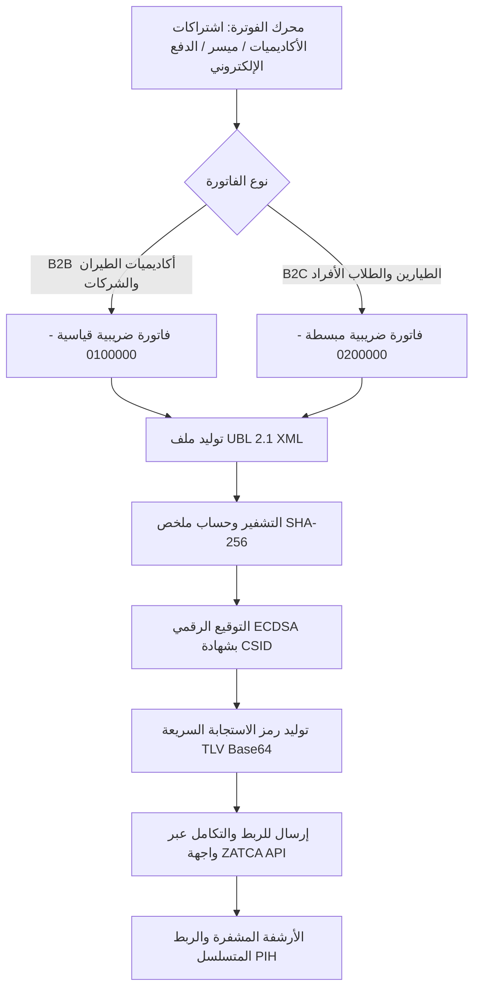

# الهيكل التقني والامتثال لمنظومة الفوترة الإلكترونية (المرحلة الثانية - فاتورة زاتكا)

تحدد هذه الوثيقة البنية الهندسية والتشغيلية والنظامية لـ **التكامل مع المرحلة الثانية (مرحلة الربط والتكامل) لمنظومة الفاتورة الإلكترونية (فاتورة) التابعة لهيئة الزكاة والضريبة والجمارك (ZATCA)** عبر منصات شركة بدع الدولية (**Fly GACA** و **Captain Adel**).

---

## ١. الهوية النظامية والضريبية للمنشأة

ترث جميع الفواتير الصادرة لاشتراكات الأكاديميات (B2B) والطيارين الأفراد بياناتها حصريًا من حقائق الشركة المعتمدة في `01-governance/company-facts.md`:

| البيان | القيمة المعتمدة |
|---|---|
| الاسم القانوني (بالعربية) | **شركة بدع الدولية** |
| الاسم القانوني (بالإنجليزية) | **BDA Company International** |
| رقم السجل التجاري (CR) | **7030976893** |
| الرقم الضريبي (VAT) | **311415259500003** |
| الرقم التعريفي المميز (TIN) | **3114152595** |
| العنوان الوطني المسجل | ٢٨١٦ طريق الملك فهد، حي الصحافة، الرياض ١٣٣٢١-٦٥٤٨، المملكة العربية السعودية |
| النسبة الضريبية الأساسية | ١٥٪ ضريبة القيمة المضافة |

---

## ٢. تصنيف الفواتير والمسارات التشغيلية

### ٢.١ الفواتير الضريبية القياسية (B2B - الرمز `388 / 0100000`)
- **حالات الاستخدام**: تراخيص مقاعد دفعات أكاديميات ومدارس الطيران (مثل OxfordSaudia، SNAA، طيران أرامكو السعودية).
- **مسار الاعتماد (Clearance)**: يتم إرسال ملف XML إلى واجهة التحقق والاعتماد المباشر لدى الهيئة قبل تسليمه للعميل.
- **معرفات العميل**: الاسم النظامي، العنوان الوطني، والرقم الضريبي للجهة المشترية (إن وجد).

### ٢.٢ الفواتير الضريبية المبسطة (B2C - الرمز `388 / 0200000`)
- **حالات الاستخدام**: اشتراكات الطيارين الأفراد في باقة Pro وتذاكر موسم الاختبارات وحزم التحضير لاختبارات GACA.
- **مسار الإشعار (Reporting)**: تصدر الفاتورة فورياً متضمنة رمز TLV وتُرسل للهيئة في مدة أقصاها ٢٤ ساعة.

---

## ٣. المعايير التشفيرية وهياكل البيانات

### ٣.١ رمز الاستجابة السريعة (TLV QR Code) للمرحلة الثانية
يتضمن رمز الاستجابة السريعة المطبوع على الفواتير مصفوفة ثنائية مشفرة بـ Base64 تحتوي على ٩ وسوم وفق متطلبات الهيئة:

1. **الوسم ١**: اسم المورّد (`BDA Company International` / `شركة بدع الدولية`)
2. **الوسم ٢**: الرقم الضريبي للمورّد (`311415259500003`)
3. **الوسم ٣**: الطابع الزمني لإصدار الفاتورة بصيغة ISO 8601
4. **الوسم ٤**: إجمالي الفاتورة شاملاً ضريبة القيمة المضافة (بالريال السعودي)
5. **الوسم ٥**: إجمالي مبلغ ضريبة القيمة المضافة (بالريال السعودي)
6. **الوسم ٦**: ملخص التشفير SHA-256 لملف الفاتورة XML
7. **الوسم ٧**: التوقيع الرقمي ECDSA (بواسطة مفتاح التشفير المعتمد)
8. **الوسم ٨**: المفتاح العام للمنشأة (Public Key)
9. **الوسم ٩**: توقيع شهادة الاعتماد الصادرة من هيئة الزكاة والضريبة والجمارك

### ٣.٢ الربط التشفيري المتسلسل (Previous Invoice Hash - PIH)
تحمل كل فاتورة جديدة قيمة هاش الفاتورة السابقة لها في الحقل `<cac:AdditionalDocumentReference>` مما يمنع التلاعب بالسجلات المالية وينشئ تسلسلاً محاسبياً غير قابل للتعديل.

---

## ٤. المراجع التقنية في الكود

- المحرك البرمجي: `FlyGACA/server/src/zatca-core.ts`
- اختبارات التحقق الآلي: `FlyGACA/server/tests/zatca-core.test.ts` (٤ اختبارات شاملة لتوليد XML وتشفير TLV وحسابات الضريبة واشتراكات الأكاديميات).
- قالب الفاتورة الضريبية: `Office/03-finance/tax-invoice-template.html`

---

## ٥. الحفظ والأرشفة النظامية

وفقاً للمادة ٦٦ من اللائحة التنفيذية لضريبة القيمة المضافة، يتم حفظ كافة الفواتير الإلكترونية وسجلاتها التشفيرية في خوادم سحابية محلية داخل أراضي المملكة العربية السعودية (منطقة GCP الدمام `me-central2`) لمدة لا تقل عن **٦ سنوات نظامية (٧٢ شهراً)**.
