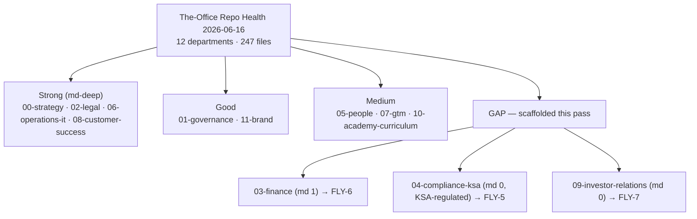

# The-Office — تقرير صحة المستودع

_الحالة: حالي · آخر تحديث: 2026-06-16 · المالك: ops_

هذه هي البوابة الأمامية الوحيدة لصحة مستودع توثيق **The-Office**.
وهو يوحّد عمليات التدقيق القائمة (المرتبطة أدناه)، ويسجّل الحلول المعتمدة لـ
الحقائق التي ظلّت تُعاد مناقشتها مرارًا، ويمنح كل إدارة درجة بحسب عمق التوثيق، ويتتبّع
إجراءات النظافة/الهيكلة المفتوحة. وهو **عن هذا المستودع** (الوثائق
التشغيلية)؛ أما شيفرة التطبيق فتوجد في مستودعات منفصلة ولا تُغطّى إلا حيث
يشير تدقيق وثائقي إليها.

> **المستودع في لمحة (2026-06-16):** 12 إدارة مرقّمة · 247 ملفًا متتبّعًا ·
> مستودع توثيق/مواصفات (لا مصدر تطبيق). أُعيد تنظيمه وجرى مسح للنظافة في هذا التاريخ.

---

## 1. عمليات التدقيق القائمة (لا تُكرّر — اربط)

تبقى هذه التقارير مرجعية في مجالاتها. اقرأها من مصدرها؛ هذا التقرير
يلخّص الحالة فقط ويُغني عن البحث عنها.

| التدقيق | النطاق | الموقع |
|---|---|---|
| Improvement Audit | مراجعة من خمسة أركان لشيفرة التطبيق/تجربة المستخدم/المحتوى/الاستراتيجية | `improvement-audit.md` |
| QA Consistency Sweep | اتساق الحقائق بين الوثائق (المنطقة، أعداد المتون) | `qa-consistency-sweep-2026-06-14.md` |
| Content QA | جودة استخراج متن GACAR (التعرّف الضوئي على الحروف، المرابط) | `content-qa.md` |
| Consolidation Manifest | ما الذي دُمج/استُبدل أثناء التوحيد | `consolidation-manifest-2026-06-16.md` |
| Content Integration Plan | كيفية دمج المحتوى الخارجي في المكتبة | `content-integration-plan.md` |
| Test Coverage Analysis | تدقيق فجوة المواصفات مقابل الاختبارات عبر `SPEC-*` | `test-coverage-analysis-2026-06-16.md` |
| Legal Gap Audit | اكتمال الحزمة القانونية | `../02-legal/legal-gap-audit-2026-06-14.md` |
| HR Pack Gap Audit | اكتمال حزمة الموارد البشرية | `../05-people/hr-pack-gap-audit-2026-06-14.md` |
| Ground-School Gap Audit | تغطية المنهج | `../10-academy-curriculum/ground-school-curriculum-gap-audit-2026-06-14.md` |

## 2. الحقائق المعتمدة والمحسومة (توقّفوا عن إعادة مناقشتها)

حسم مسح الاتساق حقيقتين تتكرران عبر الوثائق. **هذه القيم
مرجعية**؛ وإذا خالفتها وثيقة، فالوثيقة قديمة، وليس هذا الجدول.

### 2.1 تعيين منطقة GCP

| المنطقة | الموقع | الدور |
|---|---|---|
| `me-central1` | **الدوحة، قطر** | حوسبة مؤقتة (Cloud Run)؛ **ليست** داخل المملكة |
| `me-central2` | **الدمام، المملكة العربية السعودية** | هدف نظام حماية البيانات الشخصية (PDPL)؛ Firestore يعمل هنا فعليًا؛ الحوسبة قيد الانتظار |

تستخدم نحو 170 حالة عبر المستودع هذا التعيين بشكل صحيح. ملفان كانا يعكسانه
**عكسًا** (وُسما للتحرير البشري في المسح): `00-strategy/book-of-fly-gaca-review-2026-06-14.md`
السطر 60 و`.claude/agents/flygaca-qa-reviewer.md` السطر 15.

### 2.2 أعداد المتون

المعتمد: **74 جزءًا من GACAR · 21 دليلًا موضوعيًا · 190 وثيقة مرجعية · 61 مطارًا ·
13 خريطة**، مفهرسة بـ BM25 عبر **47,361 مقطعًا**.

الأرقام القديمة الواجب تجاهلها (تسبق دمج الأدلة): "96 وثيقة / 75 جزءًا / 17 كتابًا
إلكترونيًا إداريًا / 29,749 مقطعًا" في `the-book-of-fly-gaca.html` السطر 771. لاحظ أن "17 كتابًا
إلكترونيًا إداريًا" (ملفات PDF لأدلة إرشادات الهيئة العامة للطيران المدني) هي *مجموعة مختلفة* عن "21 دليلًا" في التطبيق
(كتب إلكترونية موضوعية بصيغة HTML).

## 3. بطاقة درجات عمق التوثيق

عمق Markdown مؤشر تقريبي لـ "هل فكر هذه الإدارة مكتوب وقابل للمقارنة"،
وليس لجودة المخرجات المصقولة بصيغة `.docx`/`.xlsx` (التي قد تكون ممتازة
بينما `md=0`).

| الإدارة | الملفات | `.md` | العمق | ملاحظة |
|---|---:|---:|---|---|
| 00-strategy | 25 | 7 | ●●●● | سرد قوي + جلسات عصف ذهني |
| 01-governance | 12 | 4 | ●●● | بيانات وصفية للمستودع + اتفاقيات أساسية |
| 02-legal | 26 | 17 | ●●●● | أعمق تغطية md؛ مذكرات + تدقيقات |
| 03-finance | 10 | 1 | ●○○○ | **فجوة** — فقط monetization.md بصيغة md |
| 04-compliance-ksa | 13 | 0 | ○○○○ | **فجوة (الأعلى قيمة)** — منظّمة في المملكة، بلا md |
| 05-people | 14 | 3 | ●●○ | تدقيق + بعض الملاحظات |
| 06-operations-it | 48 | 36 | ●●●● | محور المواصفات/أدلة التشغيل |
| 07-gtm | 14 | 4 | ●●○ | كتيبات اللعب معظمها بصيغة docx |
| 08-customer-success | 17 | 9 | ●●●● | موثّق جيدًا بصيغة md |
| 09-investor-relations | 21 | 0 | ○○○○ | **فجوة** — عرض/xlsx فقط، بلا أطروحة md |
| 10-academy-curriculum | 11 | 3 | ●●○ | منهج + تدقيق |
| 11-brand | 29 | 5 | ●●● | نظام تصميم + أصول |

ثلاث إدارات جرى تأسيس هيكلها هذه الجولة لسدّ أسوأ فجوات md (انظر §4): `03-finance`،
`04-compliance-ksa`، `09-investor-relations`.

## 4. متتبّع الإجراءات

| # | المجال | الإجراء | الحالة |
|---|---|---|---|
| H1 | النظافة | إضافة `.gitignore` (DS_Store/bak/مخلفات المحرر) | ✅ تم |
| H2 | النظافة | إلغاء تتبّع 4 ملفات `.DS_Store` + ملف `.bak` واحد | ✅ تم |
| H3 | النظافة | الإعلان عن الملفات الثنائية في `.gitattributes` | ✅ تم |
| H4 | النظافة | حذف الكعب المهجور `FLYGACA_DOCUMENTATION_COMPILATION.md` | ✅ تم |
| N1 | التسمية | توحيد أسماء الملفات إلى ASCII بنمط kebab-case؛ إصلاح الروابط + `_INDEX.md` | ✅ تم |
| N2 | التسمية | توثيق الاصطلاح (§6 أدناه) | ✅ تم |
| C1 | المحتوى | تأسيس هيكل وثائق md للمالية / الامتثال / المستثمرين | ✅ تم (قوالب) |
| C2 | المحتوى | تحديث وثائق الحالة القديمة (PHASE0، ROADMAP، الإحاطات) | ✅ تم (موسومة) |
| X1 | خارجي | تحديث الفهرس الرئيسي في Google-Sheet + أي روابط عميقة في Drive تشير إلى الملفات المُعاد تسميتها | ⛔ إجراء مطلوب من المالك |
| X2 | المحتوى | إصلاح مرجعَي المنطقة المعكوسين (§2.1) | ⛔ إجراء مطلوب من المالك |
| X3 | المحتوى | تحديث `the-book-of-fly-gaca.html` السطر 771 إلى الأعداد المعتمدة (§2.2) | ⛔ إجراء مطلوب من المالك |
| X4 | المحتوى | 41 مرجعًا متقاطعًا معطوبًا موجودًا مسبقًا في الوثائق المضمّنة يشير إلى هيكل مستودع التطبيق (`../functions/`، `../scripts/`، `office/`/`docs/` المسطّح)؛ سابق لهذا العمل، لم تسبّبه إعادة التسمية | ⛔ إجراء مطلوب من المالك |

## 5. ملاحظات وتحفظات

- **أسماء الملفات الآن بأحرف صغيرة بنمط kebab-case**، وهو أقل ملاءمة لـ Drive من النمط
  السابق Title Case لكنه متّسق وآمن للروابط. ينبغي أن تتبع الملفات الجديدة §6.
- **نتائج شيفرة التطبيق** (improvement-audit، test-coverage-analysis) تُتتبّع هنا
  لأغراض الوضوح لكن يُعمل بها في مستودعات التطبيق (`functions/`، `assets/`، `captadel/`)،
  لا في The-Office.
- **تُركت ملفات الإرشادات المضمّنة دون مساس.** `01-governance/CLAUDE.md` (و
  `CONTRIBUTING.md`) تصف هيكل مستودع *التطبيق* (`office/`، `functions/`)، لذا
  لم تُعَد كتابة مراجع ملفاتها الداخلية عمدًا أثناء إعادة التسمية — فهي تشير إلى
  مستودع التطبيق، لا إلى The-Office.
- هذا التقرير هو المكان لتسجيل حلول صحة المستودع المستقبلية بحيث تعيش في بقعة
  دائمة واحدة بدلًا من إحاطات متناثرة.

## 6. اصطلاح تسمية الملفات

تستخدم كل الملفات في The-Office **أحرفًا صغيرة بنمط kebab-case، ASCII فقط**:

- أحرف صغيرة؛ كلمات مفصولة بشرطات مفردة (`-`).
- المسافات ← `-`؛ `&` ← `and`؛ الأقواس تُحذف؛ الشرطات السفلية ← `-`؛ الشرطات الطويلة/القصيرة ← `-`.
- لا مسافات، ولا Unicode، ولا `&()` — يبقي الأسماء آمنة للروابط وآمنة للصدفة.
- إبقاء لواحق التاريخ بصيغة `-YYYY-MM-DD` (مثل `legal-gap-audit-2026-06-14.md`).
- **استثناءات (تبقى كما هي):** ملفات GitHub/المستودع القياسية — `README*`، `LICENSE`، `SECURITY.md`،
  `CONTRIBUTING.md`، `CODE_OF_CONDUCT.md`، `CLAUDE.md` — و`_INDEX.md` على المستوى الأعلى، و
  دليل أدوات `.claude/`.

أمثلة: `Annual Strategic Plan & OKRs (FY2026-2027).docx` ← `annual-strategic-plan-and-okrs-fy2026-2027.docx`؛
`SPEC-crm.md` ← `spec-crm.md`؛ `00 Brainstorms — Index.docx` ← `00-brainstorms-index.docx`.

## 7. المرايا الخارجية والتتبّع

هذا التقرير معتمد في git. ولأغراض الوضوح يُنسخ إلى التطبيقات المتصلة، و
متابعات المالك (§4، صفوف X) تُتتبّع كقضايا Linear:

| الموقع | ماذا | الرابط |
|---|---|---|
| Notion | نسخة قابلة للقراءة من هذا التقرير | `app.notion.com/p/38228777bb7b81a89604f12382d15abd` |
| Google Drive | ملف CSV لتسوية أسماء الملفات (204 أزواج قديم←جديد) | `drive.google.com/file/d/1VLQd71DoZ5SdvJjEdHJba5DBycyF0hTo` |
| Repo | نفس ملف CSV، مودَع | `../drive-index-updates.csv` |
| Linear (Flygaca) | FLY-5 الامتثال · FLY-6 المالية · FLY-7 المستثمر · FLY-8 الحالة-القديمة · FLY-9 التسوية | `linear.app/flygaca` |
| Airtable | القاعدة "The-Office Repo Health" — **Actions** (12 صفًا، متتبّع §4 هذا) + **Renames** (204 أزواج قديم←جديد) | `airtable.com/appuQmMO0TK5o4RAZ` |
| Lucid | مخطط بطاقة درجات صحة الإدارات (عمق الوثائق + إبرازات فجوة FLY-5/6/7) | `lucid.app/lucidchart/696634c6-1850-4a11-a5dd-03a4f34c474e/view` |
| Google Calendar | 5 تذكيرات (Asia/Riyadh) لـ FLY-5…FLY-9، مُوزّعة بحسب الأولوية | `calendar.google.com` (flygaca@gmail.com) |
| Jira (flygaca) | FLY-5…FLY-9 منسوخة كمهام KAN-4…KAN-8 في مشروع KAN | `flygaca.atlassian.net/browse/KAN-4` |
| Canva | ملخص تقرير "Repository Health" بصفحة واحدة وعلامة تجارية (4 صفحات، قابلة للتحرير) | `canva.com/d/Hu3E3N-TmO1VSuT` |

**تطبيقات جرى تقييمها للربط لكنها لم تُوصَل عمدًا** (سجلّ أمين):
- **Cloudflare / Vercel / Netlify** — نشر هذا المستودع (الذي يحوي وثائق قانونية ومالية وامتثال
  ومستثمرين) إلى مزوّد استضافة سيكشف موادًا داخلية؛ **لم** يُنشر آليًا.
- **Semrush** — لا تتضمن الخطة المتصلة وصول MCP/API (`semrush.com/mcp-access`).
- **HubSpot** — متصل، لكنه يصمّم العملاء/الصفقات، لا مصنوعات المستودع؛ لا ملاءمة نظيفة.
- **Zoom / Amplitude** — متصلان لكن فارغان (لا تسجيلات / لا أحداث منتج) — لا شيء لنسخه.
- **Confluence / Slack** — غير متاحين على الحسابات المتصلة (Atlassian بـ Jira فقط؛ لا رابط Slack).

ملف Google Sheet الرئيسي لفهرس الأوراق مقفول من وصول الذكاء الاصطناعي ("غير مؤهل لسياقات
الذكاء الاصطناعي التوليدي")، لذا تعذّرت تسويته آليًا؛ يحمل FLY-9 ملف CSV للصق اليدوي.
طُلبت مرآة Confluence لكنها **خُطّيت**: موقع Atlassian المتصل
(`flygaca.atlassian.net`) يكشف Jira فقط — لا منتج/نطاق Confluence — لذا تبقى صفحة Notion
أعلاه المرآة المعتمدة خارج git.

### مخطط صحة الإدارات (Mermaid)

نسخة من بطاقة درجات Lucid، مضمّنة هنا ليعيش العنصر المرئي في git:

