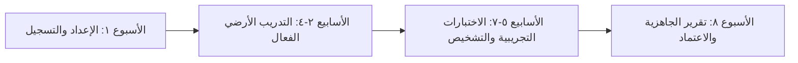

# مقترح البرنامج التجريبي لأكاديميات ومدارس الطيران

### برنامج الشراكة التجارية والدمج الأكاديمي لمدارس وأكاديميات الطيران المعتمدة في المملكة (GACAR Part 141 ATOs)

---

## ١. الملخص التنفيذي

مع تسارع وتيرة **استراتيجية قطاع الطيران المدني السعودي لعام ٢٠٣٠** لتأهيل أكثر من ٢٠ ألف كادر وطني متخصص، تواجه مراكز التدريب وأكاديميات الطيران المعتمدة (ATOs) تحدياً مشتركاً: صعوبة حفظ واستيعاب الأنظمة واللوائح المعقدة (أنظمة الطيران المدني GACAR، دليل الطيران السعودي AIP، الأرصاد الجوية، وإجراءات الطيران الآلي).

تقدم **منصة Fly GACA للمدارس** حلاً رقمياً متكاملاً للدراسة الأرضية والتمكين التنظيمي:
١. **تعليم أرضي تفاعلي مدعوم بالأنظمة**: مكتبة GACAR ثنائية اللغة كاملة مع بنوك أسئلة موثقة، وبطاقات استذكار، ومحاكاة اختبارات تجريبية محددة بوقت.
٢. **مدرب ذكاء اصطناعي متخصص (الكابتن عادل)**: مرشد تعليمي على مدار الساعة يجيب على استفسارات الطلاب مستشهداً بدقة برقم المادة من لوائح الهيئة.
٣. **لوحة تحكم لإدارة الدفعات**: قياس درجة جاهزية الدفعة، وتحليل نقاط الضعف المعرفية، وتتبع مؤشرات الاعتماد للاختبار العملي (Stage Checks).

---

## ٢. مواءمة المناهج التدريبية (GACAR Part 141)

| مرحلة التدريب | التحدي التقليدي | حلول Fly GACA | المواءمة مع GACAR |
|---|---|---|---|
| **المدرسة الأرضية لرخصة طيار خاص (PPL)** | صعوبة استيعاب فئات المجال الجوي وقواعد VFR | أداة المجال الجوي التفاعلية ثلاثية الأبعاد، وحاسبة حدود الرؤية VMC، وبنك أسئلة Part 91 | GACAR §61.105 / الملحق B من Part 141 |
| **المدرسة الأرضية لرخصة طيار تجاري (CPL)** | ارتفاع نسبة التعثر في أنظمة الطيران وقوانين التشغيل | دراسة تفصيلية لأجزاء 91 و 121 و 135، وحسابات احتياطي الوقود، والوزن والتوازن | GACAR §61.125 / الملحق D من Part 141 |
| **أهلية الطيران الآلي (Instrument Rating)** | تعقيد إجراءات الدخول في أنماط الانتظار (Holding) والأرصاد | محلل أنماط الانتظار، ومثلث الرياح الملاحي، وبث الأرصاد المباشر METAR/TAF | GACAR §61.65 / الملحق C من Part 141 |
| **دراسة دليل الطيران السعودي (AIP-KSA)** | صعوبة التصفح في ملفات PDF الضخمة والإحالات المرجعية | دليل مطارات تفاعلي لـ ٦١ مطاراً سعودياً، وساعات الشروق والغروب، ومجالات المراقبة | فصول GEN / ENR / AD من AIP السعودي |

---

## ٣. لوحة تحكم الإدارة وتحليلات الأداء

تمكّن لوحة التحكم المخصصة رؤساء مدربي الطيران (Chief Instructors) ومدربي المواد الأرضية من:

- **تتبع جاهزية الدفعة**: حد نجاح آلي (٧٥٪ فأعلى) يحدد بدقة متى يكون المتدرب جاهزاً لدخول اختبارات الهيئة الرسمية.
- **تشخيص نقاط الضعف**: مؤشرات قياس جماعية تحدد المواضيع التي تحتاج إلى إعادة شرح (مثل إجراءات ضبط مقياس الارتفاع، وفصل اضطرابات التيارات الهوائية).
- **اعتمادات المراحل التدريبية (Stage Checks)**: سجلات تدريبية موثقة ومعتمدة تثبت إتمام المتطلبات النظرية قبل الصعود للطائرة.
- **الامتثال لنظام حماية البيانات الشخصية (PDPL)**: توافق كامل مع متطلبات الخصوصية الوطنية وإدارة موافقات الطلاب.

---

## ٤. الباقات التجارية للمنشآت

تُفوتر جميع الباقات سنويًا عبر **شركة بدع الدولية** (سجل تجاري: 7030976893، رقم ضريبي: 311415259500003) بنظام الفاتورة الإلكترونية المعتمد من زاتكا:

| الفئة | السعة | أبرز المزايا | قيمة الاستثمار |
|---|---|---|---|
| **دفعة (Cohort)** | حتى ٢٥ مقعداً | التحاق لمدة ٩٠ يوماً، لوحة إدارة، تصدير CSV لتقارير الجاهزية، دعم فني | **١٢,٥٠٠ ريال** / دفعة |
| **أكاديمية (Academy)** | حتى ١٠٠ مقعد | التحاقات مستمرة طوال العام (١٢ شهراً)، صفحة هبوط بشعار الأكاديمية، دعم ذو أولوية | **٣٩,٠٠٠ ريال** / سنة |
| **مؤسسة (Institution)** | أكثر من ١٠٠ مقعد | دخول موحد SSO، ورشة لمواءمة المناهج التدريبية، مدير حساب مخصص | **تسعير مخصص** |

---

## ٥. خطة البرنامج التجريبي (٦٠ يوماً)

ندعو الأكاديميات الرائدة في المملكة (مثل OxfordSaudia، أكاديمية الطيران الوطنية SNAA، أكاديمية طيران) لبدء **دفعة تجريبية منظمة لمدة ٦٠ يوماً**:

١. **الأسبوع الأول (التهيئة)**: تسجيل مقاعد الدفعة عبر ملف CSV، وعقد جلسة تدريبية للمدربين.
٢. **الأسابيع ٢–٤ (المذاكرة والتطبيق)**: دراسة أوراق المراجعة ثنائية اللغة، وحل الأسئلة بمساعدة كابتن عادل.
٣. **الأسابيع ٥–٧ (الاختبارات المحاكية)**: عقد اختبارات تجريبية محاكية لاختبارات الهيئة مع رصد نقاط القوة والضعف.
٤. **الأسبوع الثامن (التقييم والتعاقد السنوي)**: مراجعة تقرير نسبة النجاح المتوقعة وتفعيل التعاقد السنوي.

---

## ٦. التواصل والخطوات التالية

لبدء البرنامج التجريبي لدفعتكم القادمة:
- **المبيعات والشراكات**: `sales@flygaca.com`
- **المقر الرئيسي**: شركة بدع الدولية، الرياض، المملكة العربية السعودية
- **بوابة المدارس**: [flygaca.com/schools](https://flygaca.com/schools)
