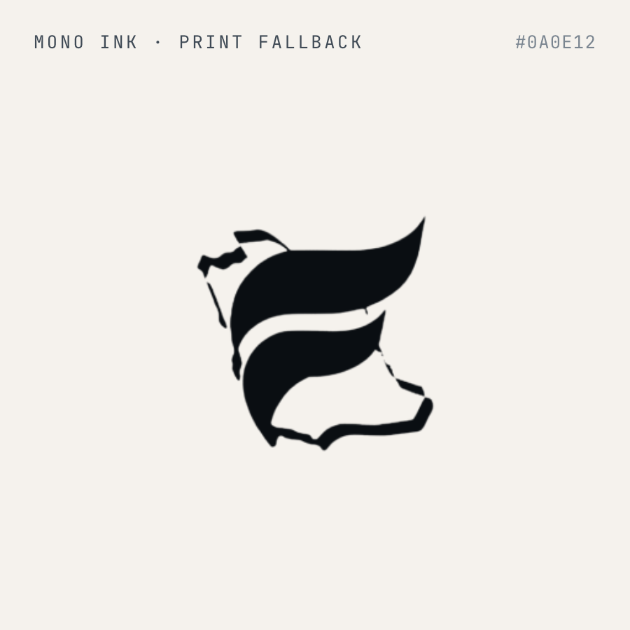
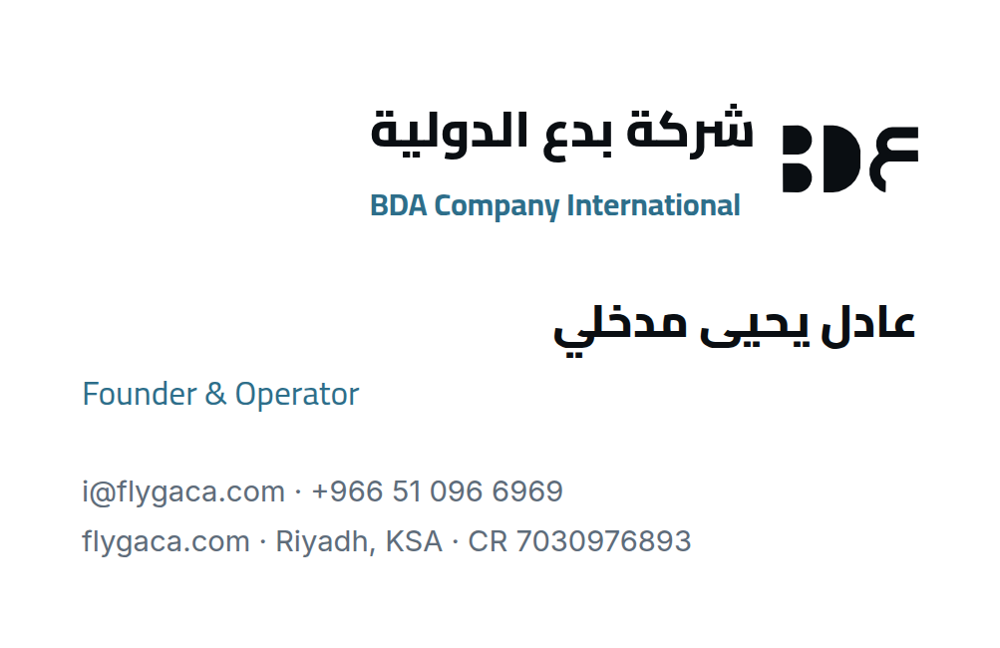

<div align="center">

# ✈️ فلاي قاكا (Fly GACA) — المكتب

**نظام التشغيل الكامل لمنصّة التعليم المستقلّة للطيران المدني في المملكة العربية السعودية.**

*كل وثيقة وسياسة ودليل عمل ومواصفة تُدير فلاي قاكا — في مستودع واحد خاضع لإدارة الإصدارات.*

[](../../../actions/workflows/docs-check.yml)
[](00-strategy/roadmap.md)
[](../01-governance/LICENSE)
[](../ar/)
[](_INDEX.md)
[](../_print/)

**[📖 الفهرس الرئيسي](_INDEX.md)** · **[🗺 خارطة الطريق](00-strategy/roadmap.md)** · **[🖨 خطّ إنتاج الطباعة](../tools/print/README.md)** · **[🌐 النسخة العربية](_INDEX.md)**

</div>

---

## ما هذا؟

**ay2m/Office** («المكتب») هو مستودع الوثائق الداخلية لـ[فلاي قاكا](https://flygaca.com) — منصّة تعليمية مستقلّة ومكتبة تنظيمية مفتوحة للطيران المدني السعودي (لوائح GACAR، ودليل الطيران AIP، والخرائط، والمدرسة الأرضية، والكابتن عادل مدرّب الطيران بالذكاء الاصطناعي).

يخزّن هذا المستودع كل وثيقة تشغيلية تُدير الشركة: الاستراتيجية والأهداف والنتائج الرئيسية (OKRs)، وقواعد الحوكمة، والعقود القانونية، والسياسات المالية، وحزم الامتثال السعودية (PDPL، والمرحلة الثانية من الفاتورة الإلكترونية لزاتكا ZATCA، وMISA، ونطاقات)، وأطر الموارد البشرية، ومقترحات وأدلّة النفاذ إلى السوق لأكاديميات الطيران، ومواد المستثمرين، وأصول العلامة التجارية، ومواصفات المنتج والهندسة.

**ولا يحتوي على أي شيفرة مصدرية للتطبيق** — فبرمجيات منتج فلاي قاكا تقيم في مستودعات مستقلّة مخصّصة:

| المستودع | الدور والوصف |
| --- | --- |
| **ay2m/Office** (هذا المستودع) | نظام تشغيل الأعمال — الاستراتيجية والحوكمة والشؤون القانونية والمالية والامتثال السعودي (PDPL، والمرحلة الثانية من زاتكا) والموارد البشرية والنفاذ إلى السوق |
| [ay2m/FlyGACA](https://github.com/ay2m/FlyGACA) | flygaca.com — تطبيق الويب التقدّمي (PWA) ثنائي اللغة المبني على React 19 + Vite **و**خلفيّته المبنية على Express والعاملة على Cloud Run (`me-central2`، وCloud SQL، وMoyasar)، إضافةً إلى المصنّف التنظيمي وأكثر من 55 أداة طيران وبث الأرصاد NOAA المباشر |
| [ay2m/Captain-Adel](https://github.com/ay2m/Captain-Adel) | خدمة مدرّب الطيران بالذكاء الاصطناعي (captadel.com) + محرّك البحث الهجين الكثيف BGE-M3 لـ RAG واستدعاء الدوال وتقييمات الـ 138 حالة |
| [ay2m/FlyGACA-ios](https://github.com/ay2m/FlyGACA-ios) | عائلة تطبيقات SwiftUI الأصيلة — حزمة `FlyGACAKit` المشتركة + هدفا ELPT وAIP في متجر التطبيقات |
| [ay2m/FlyGACA-app](https://github.com/ay2m/FlyGACA-app) | **مؤرشَف.** السلف المتقاعد لـ`ay2m/FlyGACA`، للقراءة فقط، محفوظ من أجل تاريخه البالغ 1,005 إيداعات |

أربعة مستودعات حيّة إضافةً إلى واحد مؤرشَف؛ وهذا هو نظام تشغيل الوثائق الداخلية. وتصف وثائق أسبق
في هذه الشجرة حسابًا باسم `FlyGACA/…` وستة مستودعات لكل وحدة في متجر التطبيقات — تلك المسارات
تحويلات قديمة إلى `ay2m/…`، والمستودعات الستة لم توجد قط.

> [!IMPORTANT]
> **فلاي قاكا غير مرتبطة بالهيئة العامة للطيران المدني** (GACA). كل وثيقة وكل واجهة موجَّهة للمستخدم تُرسّخ قاعدة واحدة: التحقّق من أحدث منشور رسمي للهيئة. هذه المنصّة تساعدك على *إيجاد* التنظيمات و*دراستها* — ولا تحلّ محلّها أبدًا.

---

## 🚀 البدء السريع

```bash
# استنساخ المستودع
git clone https://github.com/ay2m/Office.git
cd Office

# تصفّح الفهرس الرئيسي
open _INDEX.md          # macOS
xdg-open _INDEX.md      # Linux

# إعادة توليد ملفات PDF الجاهزة للطباعة بعد تعديل أي ملف .md
cd tools/print
npm ci                  # تثبيت لمرة واحدة (يستخدم Chromium المثبَّت مسبقًا)
npm run build           # بناء تزايدي — يعالج الوثائق المتغيّرة فقط
npm run check           # التحقّق من البيانات الوصفية وحداثة ملفات PDF (بوّابة CI)
```

> [!NOTE]
> يستخدم خطّ إنتاج الطباعة **Node 20+** و**Chromium ≥ 131** بلا واجهة. وخطوط التنضيد مضمَّنة في `tools/print/fonts/`، مما يتيح معالجة تعمل دون اتصال بالكامل. دليل الاستخدام الكامل: [`tools/print/README.md`](../tools/print/README.md).

---

## 📂 بنية المستودع

يُنظَّم المستودع في اثني عشر قسمًا مرقّمًا (`00–11`)، كلٌّ منها مبنيّ ومتصفَّح باستقلال:

| القسم | العنوان | المحتوى والنطاق |
|---|---------|---------------|
| [`00`](00-strategy/) | **الاستراتيجية** | خارطة الطريق الرئيسية، والخطة الاستراتيجية السنوية والأهداف والنتائج الرئيسية، وخطة تنفيذ الرئيس التنفيذي (السبرنتات 0–3)، ومتعقّب المرحلة 0، والعصف الذهني الاستراتيجي (00–10) |
| [`01`](01-governance/) | **الحوكمة** | اتفاقية المؤسّسين، واتفاقية المساهمين، وخطة ESOP، ومدوّنة السلوك، وسجل القرارات، وحزم المجلس، وحوكمة المستودع (`CLAUDE.md` و`CONTRIBUTING.md` و`SECURITY.md` و`LICENSE`) |
| [`02`](02-legal/) | **الشؤون القانونية** | اتفاقيات عدم الإفصاح، واتفاقية المستخدم، واتفاقية مستوى الخدمة، واتفاقية التجربة التمهيدية، وسياسة الخصوصية وفق PDPL، واتفاقية معالجة البيانات، وإجراء الملكية الفكرية والإزالة، وسياسة الاسترجاع، وموجزات المحامين السعوديين |
| [`03`](03-finance/) | **المالية** | سياسة البنوك والخزينة، والمشتريات، وسياسة المصروفات، ومتعقّبات الموازنة مقابل الفعلي، ولوحات المعلومات المالية، وقوالب الفوترة الإلكترونية لدى ZATCA |
| [`04`](04-compliance-ksa/) | **الامتثال (السعودية)** | رخصة الاستثمار من MISA، وهيكل الفوترة الإلكترونية للمرحلة الثانية لدى ZATCA، وبرنامج الامتثال وتقييم أثر حماية البيانات (PDPL)، وخطة نطاقات، وخطط استمرارية الأعمال والتعافي من الكوارث |
| [`05`](05-people/) | **الموارد البشرية** | عقود العمل المتوافقة مع النظام السعودي، ودليل الموظف، والأوصاف الوظيفية، وقوائم الإعداد والتهيئة وإنهاء الخدمة، وقوالب تقييم الأداء |
| [`06`](06-operations-it/) | **العمليات / تقنية المعلومات** | إعداد المكتب الرقمي، ومواصفات المنتج (إدارة علاقات العملاء، والكابتن عادل، ولوحة المدرّب)، وأدلّة التشغيل، ومخطّطات البنية التحتية، وحزم الإعداد |
| [`07`](07-gtm/) | **النفاذ إلى السوق** | مقترحات البرامج التجريبية لمدارس الطيران (Part 141 ATOs)، وأدلّة المبيعات، ونصوص العروض التوضيحية، ومسار صفقات B2B، واستراتيجية تحسين محركات البحث |
| [`08`](08-customer-success/) | **نجاح العملاء** | أدلّة الإعداد والتهيئة، وإطار درجة صحّة العميل، وحزم استبيان NPS، وقوالب المراجعة الربعية، وأدلّة منع التسرّب |
| [`09`](09-investor-relations/) | **علاقات المستثمرين** | عرض الاستثمار، والأسئلة الشائعة للمستثمرين، واستبيان العناية الواجبة، وقوالب التحديث الشهري للمستثمرين، وسجل المخاطر، وقائمة المستثمرين السعوديين المستهدفين |
| [`10`](10-academy-curriculum/) | **الأكاديمية والمنهج** | خريطة المنهج، ومصفوفة التغطية، والاختبارات التجريبية لرخصة الطيار الخاص، ومسارات التعلّم الذاتي B2C، وإعداد المدرّبين، وحزم ترحيب طلاب الطيران |
| [`11`](11-brand/) | **العلامة التجارية** | نظام تصميم «الصقر»، ورموز التصميم، ودليل الأسلوب، والشعارات، ومطبوعات العلامة (أوراق رسمية إنجليزية + عربية RTL، وبطاقات أعمال، وأغلفة) |

**المجلدات المساندة:**

| المجلد | الغرض |
|---|---|
| [`_INDEX.md`](_INDEX.md) | فهرس رئيسي سهل القراءة عبر الأقسام الاثني عشر |
| [`templates/`](templates/) | بدايات Markdown قابلة لإعادة الاستخدام (`tpl-fin-report` و`tpl-hr-policy` و`tpl-legal-memo` و`tpl-ops-runbook` و`tpl-strat-proposal`) |
| [`ar/`](../ar/) | نسخة **عربية (فصحى بالاصطلاح السعودي)** كاملة للأقسام الاثني عشر والقوالب — البنية نفسها وأسماء ملفات ASCII نفسها |
| [`tools/print/`](../tools/print/) | خطّ إنتاج المعالجة من Markdown وHTML إلى PDF بقياس A4 بهوية العلامة (سمة «الصقر» للوثائق، خطوط تعمل دون اتصال، إنجليزي + عربي RTL) |
| [`_print/`](../_print/) | ملفات PDF المولّدة الجاهزة للطباعة، محاكيةً شجرة الملفات بالضبط (متعقَّبة في git) |
| [`contracts/`](../contracts/) | [`flygaca-family.json`](../contracts/flygaca-family.json) — عقد العائلة العابر للمستودعات، المشترك مع مستودعي المنتجات ([التفاصيل](#-عقد-العائلة)) |
| [`tools/contracts/`](../tools/contracts/) | `stamp-manifest.mjs` — يختم بصمة الملف الذاتية ويتحقّق منها |

---

## ✨ القدرات الرئيسية

| القدرة | التفصيل |
|-----------|--------|
| 🗂 **عمليات خاضعة لإدارة الإصدارات** | كل سياسة وعقد ومواصفة تقنية متعقَّبة في Git — بتاريخ فروق ومسؤولية كامل. |
| 🖨 **خطّ إنتاج طباعة آلي** | أي تعديل على `.md` يُعاد معالجته إلى ملف PDF بقياس A4 بهوية العلامة وبعلامة مائية، عبر Chromium بلا واجهة. |
| 🌍 **ثنائية اللغة أصالةً (EN / AR)** | نسخة عربية (فصحى بالاصطلاح السعودي) موازية تحت `ar/`؛ وتبقى أسماء الملفات ASCII بنمط kebab-case متطابقة لتسهيل المقارنة (128 EN / 128 AR). |
| 📋 **بيانات وصفية YAML** | حقول موحّدة `title / section / doc_type / status / owner / last_updated / lang` على كل وثيقة. |
| 🔒 **منظومة الامتثال السعودية** | مبنية خصّيصًا للأطر النظامية السعودية: PDPL، والمرحلة الثانية للفوترة الإلكترونية لدى ZATCA، وترخيص MISA، ونطاقات. |
| 🤖 **مواصفات الكابتن عادل التقنية** | مواصفات كاملة لمدرّب الطيران بالذكاء الاصطناعي، وبروتوكول الرفض، وأدلّة النشر، ومجموعة التقييم. |
| 📐 **نظام تصميم «الصقر»** | خط Inter للمتن، وCairo للعناوين والنص العربي، وJetBrains Mono للشيفرة، ولوح ألوان «أزرق الصقر». |

---

## 🌍 التعريب العربي (`ar/`)

مجلد [`ar/`](../ar/) ترجمة عربية كاملة وموازية لشجرة الوثائق — بنية المجلدات نفسها، وأسماء ملفات ASCII نفسها، مكتوبة بـ**العربية الفصحى الحديثة (بالاصطلاح السعودي الرسمي)**.

- 128 ملف `.md` تُحفظ متزامنة بنسبة 100٪ مع المصدر الإنجليزي
- مصطلحات موحّدة وفق [`ar/_GLOSSARY.md`](_GLOSSARY.md) (مسرد المصطلحات EN↔AR)
- تُعالَج ملفات PDF العربية آليًا **من اليمين إلى اليسار** (تنضيد Cairo، وصناديق هوامش RTL)
- تبقى مسارات الشيفرة والمعرّفات وأسماء الملفات اللاتينية من اليسار إلى اليمين داخل النص العربي

> [!NOTE]
> النسخة الإنجليزية هي المصدر المرجعي المعتمد. وعند أي التباس، تحكم الوثيقة الإنجليزية.

---

## 🖨 خطّ إنتاج الطباعة وبوّابة التكامل المستمر

تولّد كل وثيقة `.md` ملف **PDF جاهزًا للطباعة بهوية العلامة** تحت `_print/`، محاكيًا شجرة المجلدات. ويستخدم خطّ الإنتاج `markdown-it` + Chromium بلا واجهة مع سمة «الصقر» للوثائق:

- **الخطوط:** Inter (المتن) · Cairo (العناوين + العربية) · JetBrains Mono (الشيفرة) — مضمَّنة للعمل دون اتصال تحت `tools/print/fonts/`
- **التخطيط:** A4، وهوامش 0.75 بوصة، وأرقام صفحات في التذييل، وكتلة غلاف مولَّدة من البيانات الوصفية YAML
- **العلامات المائية:** يضع `status: draft` أو `scaffold` علامة مائية DRAFT/SCAFFOLD آليًا
- **تزايدي:** يتعقّب `.buildcache.json` بصمات المحتوى — وتُتخطّى الوثائق غير المتغيّرة

```bash
cd tools/print
npm run build        # إعادة بناء تزايدية
npm run build:force  # إعادة بناء كل ملفات PDF من الصفر
node build.mjs 02-legal/terms-of-use-draft-2026-06-14.md   # معالجة وثيقة واحدة
node check.mjs       # تشغيل بوّابة CI للتحقّق من الحداثة والبيانات الوصفية
node check-facts.mjs # بوّابة حقائق الكيان — انظر «عقد العائلة» أدناه
```

---

## 🔗 عقد العائلة

تتشارك المستودعات الثلاثة النشطة ملفًا واحدًا مُصدَّرًا:
[`contracts/flygaca-family.json`](../contracts/flygaca-family.json)، المودَع **بصورة متطابقة تمامًا**
في هذا المستودع وفي `ay2m/FlyGACA` و`ay2m/Captain-Adel`. وُجد هذا الملف لأن ادّعاءات العائلة
العابرة للمستودعات كانت تعيش في النثر وحده، فانحرفت دون أن يفشل شيء.

ثلاث كتل، تسمّي كل واحدة منها المستودع الذي **يملكها** — ولا يعدّل الكتلة إلا مالكها:

| الكتلة | المالك | المصدر المرجعي | تُنسخ إلى |
| --- | --- | --- | --- |
| `entity` | **هذا المستودع** | [`01-governance/company-facts.md`](01-governance/company-facts.md) | `jsonld.ts` وحزمتا اللغة في `ay2m/FlyGACA`؛ و`footer.js` و`terms.html` و`privacy.html` و`package.json` و`LICENSE` في `ay2m/Captain-Adel` |
| `chat` | `ay2m/FlyGACA` | ملفه `server/src/contract.ts` | شكل الإجابة الذي يلتزم به تطبيقا «كابتن عادل» |
| `repos` | **هذا المستودع** | الجدول أعلاه | يَنسخ أي نص يشير إلى منظمة `FlyGACA/…` |

يحرس كل مستودع نصيبه ضمن التكامل المستمر القائم لديه أصلًا. وهنا هو
`node tools/print/check-facts.mjs` (المربوط بـ `docs-check.yml`، واختصاره `npm run check:facts`)،
الذي يتحقّق من مطابقة كل قيمة في `entity` لجدول `company-facts.md` الذي نُسخت منه — ومن **غياب
الآيبان ورقم الحساب** الواردين في تلك الوثيقة عن الملف، لأنه ينتقل إلى مستودعي المنتجات. ويشغّل
مستودعا المنتجات `tests/family-contract.test.ts` و`test/family-contract.test.js`.

**لذا فتغيير أي حقيقة من حقائق الشركة تغييرٌ يمسّ ثلاثة مستودعات.** عدّل `company-facts.md`،
وحدّث الملف، وارفع رقم `version`، وأعد ختم بصمته بـ
`node tools/contracts/stamp-manifest.mjs contracts/flygaca-family.json`، وانسخه حرفيًا إلى
مستودعي المنتجات، ثم افتح طلبات الدمج الثلاثة معًا. تبقى بوابة كل مستودع حمراء حتى يُنجَز نصيبه.

> قيدٌ معلوم: لا شيء يعمل دون اتصال يستطيع إثبات أن النسخ الثلاث من المراجعة ذاتها. ويقلّص
> `version` و`sha` ذلك إلى فارق سطر واحد ظاهر؛ أما إغلاقه تمامًا فيحتاج تدفّق عمل مجدولًا عابرًا
> للمستودعات، وهو غير موجود بعد.

---

## 🎨 هوية العلامة التجارية

يمنح نظام تصميم «الصقر» وأصول الشعار وقوالب الطباعة في [`11-brand/`](11-brand/) كل وثيقة من وثائق فلاي قاكا هوية موحّدة.

<p align="center">
  
  &nbsp;&nbsp;&nbsp;&nbsp;
  
  &nbsp;&nbsp;&nbsp;&nbsp;
  
</p>

---

## 🏗 خارطة الطريق وحالة التنفيذ

*تُتعقّب المراحل في [`00-strategy/roadmap.md`](00-strategy/roadmap.md).*

| المرحلة | العنوان | الحالة | الملخّص |
|-------|-------|--------|---------|
| **0** | الأسس | 🟡 قيد التنفيذ | المنظومة التقنية حيّة؛ وتسجيل الكيان القانوني السعودي ما يزال مفتوحًا |
| **1** | المكتبة المفتوحة | ✅ أُطلِقت | لوائح GACAR والمطارات وفهرس الخرائط حيّة |
| **2** | الكابتن عادل (الذكاء الاصطناعي) | ✅ أُطلِقت | مدرّب الطيران بتقنية RAG حيّ على Gemini 2.5 Flash |
| **3** | حسابات الطيارين | 🟡 مبنيّة | مصادقة بكوكيز الجلسة + Google OAuth على Cloud Run، وCloud SQL Postgres حيّة؛ وتقييم أثر PDPL قيد الانتظار |
| **4** | العربية والصقل | 🟡 قيد التنفيذ | المحرّك ثنائي اللغة حيّ؛ وترجمات الصفحات الداخلية جارية |
| **5** | تحقيق الدخل والمدارس | ⬜ مخطَّطة | مقيّدة بتسجيل الكيان القانوني |
| **6** | التطبيقات الأصيلة | 🟡 قيد التنفيذ | هدفا iOS لـELPT وAIP مبنيّان؛ والتقديم للمتجر قيد الانتظار |
| **7** | منصّة التدريب | ✅ أُطلِقت | بنك من 162 سؤالًا، وبطاقات مراجعة، وتحليلات اختبارات حيّة |
| **8** | منصّة المكتبة | ✅ أُطلِقت | بحث في المكتبة كاملة، ودروس سلامة، ومسارات قراءة حيّة |
| **9** | الإطلاق والظهور | 🟡 منشورة | تطبيق الويب منشور؛ والنطاق المخصّص والنفاذ إلى السوق نشطان |
| **10** | الكابتن عادل في الإنتاج | 🟡 قيد التنفيذ | حراس المدخلات وحدود المعدّل والتقييمات مُطلَقة |
| **11** | العمق العملي | ✅ أُطلِقت | 21 أداة طيران، و11 دليلًا، وبنك الدراسة كاملًا |

---

## 🤝 الحوكمة والمساهمة

يلتزم هذا المستودع التزامًا صارمًا بإرشادات الحوكمة في [`01-governance/`](01-governance/):

- **[CONTRIBUTING.md](01-governance/CONTRIBUTING.md)** — الإعداد، وأعراف الوثائق، وقائمة ما قبل طلب السحب
- **[CODE_OF_CONDUCT.md](01-governance/CODE_OF_CONDUCT.md)** — معايير المجتمع
- **[SECURITY.md](01-governance/SECURITY.md)** — سياسة الأمن والإفصاح المسؤول
- **[CLAUDE.md](../CLAUDE.md)** — إرشادات المساعد الذكي وتوثيق البنية

جميع الوثائق التشغيلية الخاصّة بنا مرخّصة بموجب [رخصة Apache الإصدار 2.0](../01-governance/LICENSE). أما النصوص التنظيمية المقتبسة فهي مملوكة للهيئة العامة للطيران المدني ومستثناة من هذه الرخصة.

---

<div align="center">

*بُني لسماء المملكة. ويُدار من «المكتب».*

</div>
